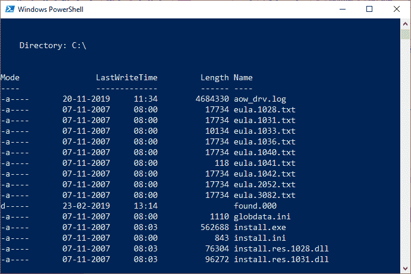
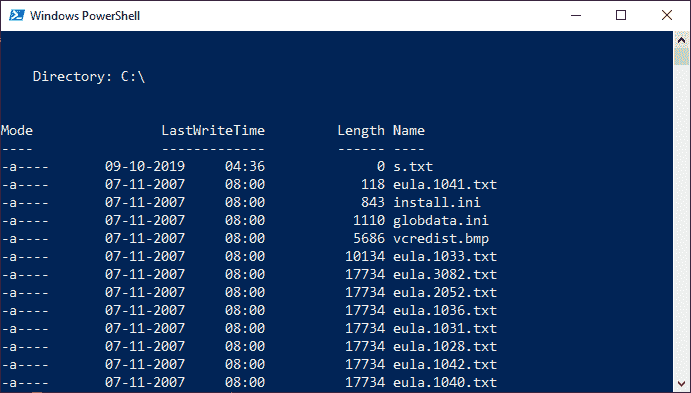
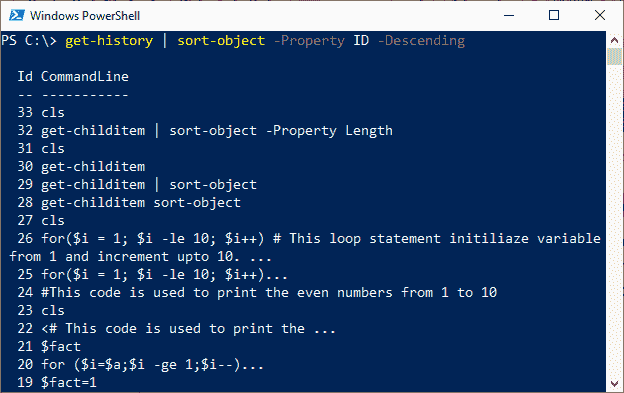

# PowerShell 排序-对象

> 原文：<https://www.javatpoint.com/powershell-sort-object>

**排序对象**是 PowerShell 的小命令，它根据属性值按顺序对对象进行排序。我们可以根据单个或多个属性对对象进行排序。各种属性使用哈希表按升序或降序对对象进行排序。

### 句法

```

Sort-Object
    [-Stable]
    [-Descending]
    [-Unique]
    [-InputObject <PSObject>]
    [[-Property] <Object[]>]
    [-Culture <String>]
    [-CaseSensitive]
    [<CommonParameters>]

```

```

Sort-Object
    [-Descending]
    [-Unique]
    -Top <Int32>
    [-InputObject <PSObject>]
    [[-Property] <Object[]>]
    [-Culture <String>]
    [-CaseSensitive]
    [<CommonParameters>]

```

```

Sort-Object
    [-Descending]
    [-Unique]
    -Bottom <Int32>
    [-InputObject <PSObject>]
    [[-Property] <Object[]>]
    [-Culture <String>]
    [-CaseSensitive]
    [<CommonParameters>]

```

## 因素

**-稳定**

该参数在**PowerShell 6 . 2 . 0 版**中引入。当排序标准相等时，排序的对象按接收的顺序分布。

**-下降**

此参数用于按降序对对象进行排序。

**-独特**

此参数用于**排序对象** cmdlet，以消除重复，并仅返回集合的唯一成员。该参数为**不区分大小写**。

**-输入对象**

当使用该参数时，**排序对象** cmdlet 只接收一个代表集合的对象。

**-物业**

此参数指定 sort-object cmdlet 用来对对象进行排序的属性的名称。在此参数中，接受通配符。如果没有在 cmdlet 中指定属性，则它会根据对象类型的默认属性进行排序。

**-培养**

此参数指定用于对对象进行排序的区域性配置。

**-案件敏感**

此参数在此 cmdlet 中用于指示排序区分大小写。默认情况下，它们不区分大小写。

## 例子

**示例 1:** 在本示例中，键入以下命令，根据名称对当前目录中的文件和文件夹进行排序:

```

PS C:\> get-childitem | sort-object

```

在这个命令中， **get-childItem** 获取当前目录下的文件和子目录。然后，对象被发送到**排序对象**小命令。

**输出:**



**示例 2:** 在本示例中，键入以下命令，根据长度对当前目录中的文件和文件夹进行排序:

```

PS C:\> get-childitem | sort-object -Property Length

```

在该命令中，**排序-对象**小命令使用**长度**参数以升序按长度对文件和目录进行排序。文件或子目录具有最大长度，显示在末尾。

**输出:**



**示例 3:** 在本例中，键入以下命令，根据 Id 对 PowerShell 会话的历史信息进行排序:

```

PS C:\> get-history | sort-object -Property ID -Descending

```

在该命令中，**获取历史记录** cmdlet 用于从当前的 PowerShell 会话中获取历史记录对象。对象被发送到**排序-对象**小程序。**排序-对象**小命令使用**属性**参数按照**标识**对对象进行排序。**-下降**参数对命令历史进行排序。

**输出:**



**示例 4:** 在本例中，键入以下命令对文本文件中的名称进行排序。

```

PS C:\> Get-Content -Path D:\Powershell\S.txt | Sort-Object

```

在该命令中，**获取内容**小命令使用**-路径**参数来指定文件和目录名。文件 S.txt 包含一个未排序的学生姓名列表。对象被发送到**排序-对象**小命令。默认情况下，**排序-对象**小命令按升序对列表进行排序。

**输出:**

```
Amisha
Amit
Devansh
Mahesh
Saket
Tarun
Yatin

```

* * *