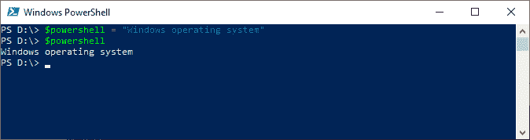

# PowerShell 变量

> 原文:[https://www.javatpoint.com/powershell-variables](https://www.javatpoint.com/powershell-variables)

变量是 Windows PowerShell 的基础部分。我们可以在 PowerShell 变量中存储所有类型的值。例如，我们可以存储命令的结果，以及表达式和命令中使用的元素，如路径、名称、设置和值。事实上，他们专门存储对象，微软。NET 框架对象。

变量是存储数据的内存单元。在 Windows PowerShell 中，变量的名称以美元 **($)** 符号开头，如 **$process** ， **$a** 。变量的名称不区分大小写，包括空格和特殊字符。默认情况下，PowerShell 中所有变量的值都是 **$null** 。

#### 注意:在 Windows PowerShell 中，特殊字符有特殊含义。如果我们在变量名中使用特殊字符，我们需要用大括号{}将它们括起来。

| 有效的变量名: | 无效的变量名: |
| $myVariable， | 我的变数， |
| $MyVariable_1， | $ my-变量， |
| {我的变量} | $我的变量 |

## 创建变量

我们使用赋值运算符(=)为变量赋值。我们可以通过赋值来创建一个变量。

以下示例用于创建变量:

**例 1:**

```

$vrb = 201

```

本例中的命令将整数值 **201** 分配给名为 **$vrb** 的变量。

**例 2:**

```

$mySubject = "PowerShell"

```

本例中的命令创建了一个名为 **$mySubject** 的变量，并为其分配了一个字符串值。在这个例子中， **$mySubject** 是一个字符串对象。

## 打印变量值

要显示变量值，请键入变量名，后跟美元符号“$”。

以下示例用于打印变量值:

**示例:**


本例中的第二个命令 **$a** 将变量值显示为“ **javatpoint** ”。

## 更改变量值

如果要更改变量值，请为该变量分配一个新值。

**示例:**


上图中的 **$PowerShell** 命令显示了一个 **$PowerShell** 变量的值。

以下屏幕中的命令更改一个 **$PowerShell** 变量的值，并显示一个 **$PowerShell** 变量的新值。



## 删除变量

如果要删除变量的值，请使用**清除变量** cmdlet，或者将其值更改为 **$null** 。

**示例:**


## 变量的类型

如果要查找变量的类型，可以使用 **GetType()** 方法。


## 变量作用域

PowerShell 变量可以有一个“**范围**，它决定了变量在哪里可用。要表示变量，请使用以下语法:

```

$[<scope-modifier>:]<name> = <value>

```

Windows PowerShell 支持变量的以下范围修饰符:

*   **全局:**全局变量是那些在任何地方都有效的变量，甚至在脚本和函数之外。要表示全局变量，请使用以下格式:

```

$Global: variable = <value>

```

*   **局部:**可以在局部范围内创建的变量。默认情况下，变量具有局部范围。要表示局部变量，请使用以下格式:

```

$variable = <value>

```

*   **脚本:**在脚本中创建的那些变量。这些变量只对创建它们的脚本可用。要表示脚本变量，请使用以下格式:

```

$script: variable = <value>

```

## 变量的类型

以下是 Windows PowerShell 中不同类型的变量:

1.  用户创建的变量。
2.  自动变量。
3.  偏好变量。

**用户创建的变量**

那些由用户创建和维护的变量称为用户创建的变量。我们在 PowerShell 命令行中创建的变量只在 PowerShell 窗口打开时存在。当 PowerShell 的窗口关闭时，变量也会被删除。我们可以在脚本中创建具有本地、全局或脚本范围的变量。

**自动变量**

那些存储 PowerShell 状态的变量称为自动变量。PowerShell 创建这种类型的变量，它们的值由 PowerShell 更改以保持其准确性。用户不能更改这些变量的值。

**偏好变量**

首选项变量是存储用户对 Windows PowerShell 首选项的变量。Windows PowerShell 创建了这种类型的变量，并用默认值填充它们。任何用户都可以更改偏好变量的值。

* * *