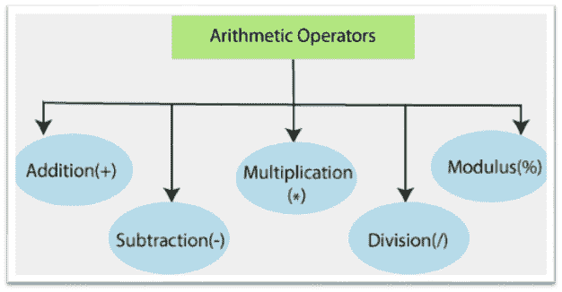

# 算术运算符

> 原文：<https://www.javatpoint.com/powershell-arithmetic-operators>

在 PowerShell 中使用**算术运算符**来计算数值。通过使用算术运算符，我们可以对值进行**加(+)、减(-)、乘(*)、**或**除(/**。这些运算符还包括**模数(%)** 运算符来计算除法运算的余数。

在 PowerShell 中，加法和乘法运算符也可以用于字符串、哈希表和数组。乘法(*)运算符返回输入的多个副本，加法(+)运算符连接输入。

**Windows PowerShell 支持以下算术运算符:**



1.  +(加法)
2.  -(减法)
3.  *(乘法)
4.  /(分部)
5.  %(模量)

## 算术运算符优先级

PowerShell 根据以下优先规则在表达式中处理这些类型的运算符:


## 加法运算符(+)

加法运算符是一种算术运算符，用于将两个数字、字符串、数组和哈希表相加。

示例:

**示例 1:** 本示例将两个数值相加:

```powershell

$a = 10
$b = 20 
$c = $a + $b
$c

```

最后一个命令将变量 **$c** 的值显示为 **30** 。

**示例 2:** 本示例添加两个字符串:

```powershell

$x = "power"
$y = "Shell" 
$z = $x + $y
$z

```

最后一个命令将变量$z 的值显示为单个字符串“ **PowerShell** ”。

**示例 3:** 本示例添加两个数组:

```powershell

$x = 1,2,3
$y = "A","B","C"
$z = $x + $y
$z

```

最后一个命令将显示数组 **$z** 的以下结果:

```powershell
1
2
3
A
B
C

```

## 减法运算符(-)

减法运算符是一种算术运算符，用于将一个数值从另一个数值中减去，并将一个数字变成负数。

**示例:**

**示例 1:** 本示例从其他值中减去一个数值:

```powershell

$a = 20
$b = 10 
$c = $a - $b
$c

```

最后一个命令将变量 **$c** 的值显示为 **10** 。

**示例 2:** 本示例将一个数字设为负数:

```powershell

$x = 10
$y = -$x
$y

```

最后一个命令将变量 **$c** 的值显示为 **-10** 。

## 乘法运算符(*)

乘法运算符是一种算术运算符，用于将数值相乘或将字符串和数组值复制到指定的次数。

**示例:**

**示例 1:** 本示例将两个数值相乘:

```powershell

$a = 10
$b = 20 
$c = $a * $b
$c

```

最后一个命令将变量 **$c** 的值显示为 **200** 。

**示例 2:** 本示例用于根据乘法运算符后指定的数字创建字符串的副本:

```powershell

$x = "Shell"
$y =$x*2
$y

```

最后一个命令将变量 **$y** 的值显示为单个字符串“ **ShellShell** ”。

**示例 3:** 此示例用于根据乘法运算符后指定的数字创建数组值的副本:

```powershell

$x = 1,2,3
$y = $x * 2
$y

```

最后一个命令将显示数组 **$y** 的以下结果:

```powershell
1
2
3
1
2
3

```

## 除法运算符(/)

**除法运算符**是一个算术运算符，用于对两个数值进行除法运算。

以下示例将两个数值相除:

```powershell

$a = 10
$b = 4 
$c = $a/$b
$c

```

最后一个命令将变量 <storng>$c 的值显示为 **2.5** 。</storng>

## 模数运算符(%)

**模数运算符**是一个算术运算符，用于计算除法运算的余数

以下示例计算两个数值的模数:

```powershell

$a = 10
$b = 4 
$c = $a % $b
$c

```

最后一个命令将变量 **$c** 的值显示为 **2** 。

* * *