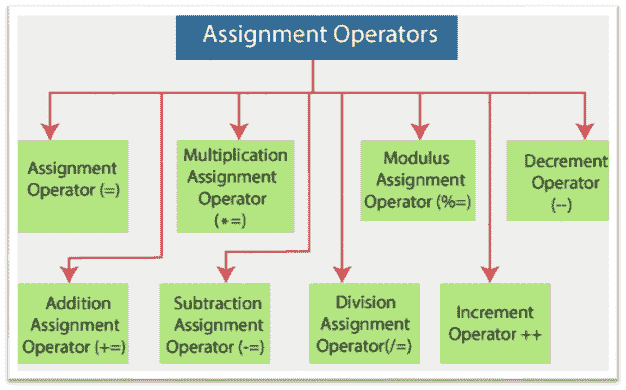

# 赋值运算符

> 原文:[https://www.javatpoint.com/powershell-assignment-operators](https://www.javatpoint.com/powershell-assignment-operators)

赋值运算符在 PowerShell 中用于赋值一个或多个值，以及更改或追加值到变量。这些运算符可以在给变量赋值之前执行数值运算。最常用的运算符是赋值运算符 **(=)** ，它将值赋给变量。

**PowerShell 支持以下赋值运算符:**



1.  =(赋值运算符)
2.  +=(加法赋值运算符)
3.  -=(减法赋值运算符)
4.  *=(乘法赋值运算符)
5.  /=(除法赋值运算符)
6.  %=(模数赋值运算符)
7.  ++(增量运算符)
8.  -(递减运算符)

## 句法

以下语句是描述如何使用赋值运算符的语法:

```

<assignable-expression> <assignment-operator> <value>

```

在上面的语句中，可赋值表达式包括变量和属性。该值可以是单个值、值数组、表达式、命令或语句。

## 赋值运算符(=)

赋值运算符是赋值运算符，用于将一个或多个值(字符串、整数或数组)赋给变量。

以下是一些描述如何使用赋值运算符的示例:

**示例 1:** 本示例用于将单个整数值赋给变量:

```

$a=10
$a

```

本例中的第二条语句将变量 **$a** 的值显示为 **10** 。

**示例 2:** 本示例用于为变量分配多个值(即数组)。在本例中，逗号分隔值:

```

$k=10, 20, 30
$k

```

本例中的第二个命令将数组 **$k** 的以下值显示为:

```
10
20
30 

```

**示例 3:** 本示例用于将字符串分配给变量:

```

$s="Windows PowerShell"
$s

```

本例中的第二个命令将变量 **$s** 的值显示为“ **Windows PowerShell** ”。

## 加法赋值运算符(+=)

**加法赋值运算符**是一个赋值运算符，它将变量的值增加一个给定值或将指定值附加到现有值上。这个运算符将两个操作结合起来。首先，它**将**的值相加，然后**将**赋给变量。

以下示例描述了如何在 PowerShell 中使用加法赋值运算符:

**示例 1:** 本示例用于将单个整数值添加到变量中:

```

$a=5
$a+=10
$a

```

本例中的最后一条语句将变量 **$a** 的值显示为 **15** 。

**示例 2:** 此示例用于将字符串追加到变量中:

```

$s="Windows"
$s += "PowerShell"
$s

```

本例中的最后一个命令将变量 **$s** 的值显示为“ **Windows PowerShell** ”。

**示例 3:** 此示例用于向数组追加一个或多个值。如果我们在一个数组中添加了多个值，请用逗号分隔它们。

```

$k=10, 20, 30
$k += 40, 50
$k

```

本例中的最后一个命令将数组 **$k** 的以下值显示为:

```
10
20
30 
40
50

```

## 减法赋值运算符(-=)

**减法赋值运算符**是一个赋值运算符，它将变量的值减少运算符右侧的给定值。这个运算符将两个操作结合起来。首先**减去**值，然后**给变量赋值**。它还会减少数值数组中元素的值。

以下示例描述了如何在 PowerShell 中使用减法赋值运算符:

**示例 1:** 本示例减小变量的值:

```

$a=50
$a -=10
$a

```

本例中的最后一条语句将变量 **$a** 的值显示为 **40** 。

**示例 2:** 本示例将数组中第二个元素的值减少-20

```

$k=10, 30, 60
$k[1] -= 20
$k

```

本例中的最后一个命令将数组 **$k** 的以下值显示为:

```
10
10
60 

```

## 乘法赋值运算符(*=)

**乘法赋值运算符**是一个赋值运算符，它将变量的值乘以给定的数值，或者将指定数量的字符串副本附加到变量上。这个运算符将两个操作结合起来。首先**将**的值相乘，然后**将**赋给变量。

以下是一些描述如何在 PowerShell 中使用乘法赋值运算符的示例:

**示例 1:** 本示例用于将整数值乘以变量:

```

$a=5
$a *= 10
$a

```

本例中的最后一条语句将变量 **$a** 的值显示为 **50** 。

**示例 2:** 此示例用于将字符串追加到变量中:

```

$s="Windows"
$s *= 2
$s

```

本例中的最后一个命令将变量 **$s** 的值显示为“**windowswdows**”。

**示例 2:** 本示例将数组中第二个元素的值乘以 4。

```

$k=10, 30, 60
$k[1] *= 4
$k

```

本例中的最后一个命令将数组 **$k** 的以下值显示为:

```
10
120
60 

```

## 除法赋值运算符(/=)

**除法赋值运算符**是一个赋值运算符，它将变量的值除以一个给定的数值，该数值在运算符的右侧指定。此运算符不能与字符串值一起使用。

这个运算符将两个操作结合起来。首先**将**的值相除，然后**将**赋给变量。

以下示例描述了如何在 PowerShell 中使用除法赋值运算符:

**示例 1:** 本示例用于划分变量的整数值:

```

$a=50
$a /= 5
$a

```

本例中的最后一条语句将变量 **$a** 的值显示为 **10** 。

**示例 2:** 本示例将数组中第一个元素的值除以 2

```

$k=100, 10, 80
$k[0] /= 2
$k

```

本例中的最后一个命令将数组 **$k** 的以下值显示为:

```
50
10 
80

```

## 模数赋值运算符(%=)

**模数赋值运算符**是一个赋值运算符，用于计算除法运算的余数。该运算符将变量值除以运算符右侧给出的指定值。之后，它将余数赋给变量。

此运算符不能用于字符串值和数组。

下面的例子描述了如何在 PowerShell 中使用**模数赋值运算符**:

本示例计算除法运算的余数:

```

$a=30
$a %= 4
$a

```

本例中的最后一条语句将变量 **$a** 的值显示为 **2** 。

## 增量运算符(++)

**增量运算符**是赋值运算符，用于将变量的值增加 1。当我们在一个简单的语句中使用这个运算符时，它不返回值。

**后缀增量运算符:**

以下示例描述了如何使用后缀增量运算符:

```

$a=5
$p = $a++
$p
$a

```

本例中的最后两个命令将变量 **$p** 和 **$a** 的值显示为 **5** 和 **6** 。

**前缀增量运算符:**

以下示例描述如何使用后缀增量运算符:

```

$a=5
$p = ++$a
$p
$a

```

本例中的最后两个命令将变量 **$p** 和 **$a** 的值显示为 **6** 。

## 递减运算符(-)

**递减运算符**是一个赋值运算符，用于将变量的值减少 1。当我们在一个简单的语句中使用这个运算符时，它不返回值。

**后缀减量运算符:**

以下示例描述如何使用后缀增量运算符:

```

$a=5
$p = $a--
$p
$a

```

本例中的最后两个命令将变量 **$p** 和 **$a** 的值分别显示为 **5** 和 **4** 。

**前缀递减运算符:**

以下示例描述如何使用后缀增量运算符:

```

$a=5
$p = --$a
$p
$a

```

本例中的最后两个命令将变量 **$p** 和 **$a** 的值显示为 **4** 。

* * *