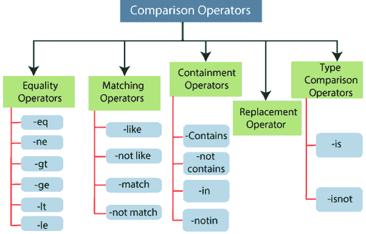

# 比较运算符

> 原文：<https://www.javatpoint.com/powershell-comparison-operators>

在 PowerShell 中使用**比较运算符**来比较值。默认情况下，所有比较运算符都区分大小写。这些操作符帮助我们查找、测试、比较、修改和替换数据和信息。

**PowerShell 支持以下比较运算符:**



1.  等式运算符
2.  匹配运算符
3.  安全壳操作员
4.  替换运算符
5.  类型运算符

## 等式运算符

**相等运算符**是检查两个值的相等性并检查一个值是否大于或小于另一个值的运算符。

以下是等式比较运算符的列表:

1.  -等式(相等)
2.  -ne(不相等)
3.  -gt(大于)
4.  -ge(大于或等于)
5.  -lt(小于)
6.  -le(小于或等于)

**-等式(相等)**

如果值相等，该运算符返回布尔值**真**，否则**假**。

**示例:**以下示例描述了如何使用-eq (equal)运算符:

```

$a=10
$b=10
($a -eq $b)

```

本例中的最后一个命令显示布尔值**真**，因为两个变量的值是相同的。

**-ne(相等)**

如果值不相等，该运算符返回布尔值**真**，否则**假**。

**示例:**以下示例描述了如何使用-eq (equal)运算符:

```

$a=10
$b=10
($a -ne $b)

```

本例中的最后一个命令显示布尔值**假**，因为两个变量的值是相同的。

**-gt(大于)**

如果运算符左侧的变量值大于运算符右侧的变量值，则该运算符返回布尔值**真**，否则返回**假**。

**示例:**以下示例描述了如何使用-gt(大于)运算符:

```

$a=20
$b=10
($a -gt $b)

```

本例中的最后一个命令显示布尔值**真**，因为变量 **$a** 的值大于 **$b** 。

**-ge(大于或等于)**

如果运算符左侧的变量值大于或等于运算符右侧的变量值，则该运算符返回布尔值**真**，否则返回**假**。

**示例:**以下示例描述了如何使用-ge(大于或等于)运算符:

```

$a=10
$b=10
($a -ge $b)

```

本例中的最后一个命令显示布尔值**真**，因为变量 **$a** 和 **$b** 的值是相同的。

**-lt(小于)**

如果运算符左侧的变量值小于运算符右侧的变量值，则该运算符返回布尔值**真**，否则返回**假**。

**示例:**以下示例描述了如何使用-lt(小于)运算符:

```

$a=10
$b=20
($a -lt $b)

```

本例中的最后一个命令显示布尔值**真**，因为变量 **$a** 的值小于 **$b** 。

**-le(小于或等于)**

如果运算符左侧的变量值小于或等于运算符右侧的变量值，则该运算符返回布尔值**真**，否则返回**假**。

**示例:**以下示例描述了如何使用-le(小于或等于)运算符:

```

$a=10
$b=10
($a -le $b)

```

本例中的最后一个命令显示布尔值**真**，因为变量 **$a** 和 **$b** 的值是相同的。

## 匹配运算符

**匹配运算符**是那些使用正则表达式或通配符对字符串进行比较以找到匹配的运算符。

以下是匹配运算符的列表:

1.  表示“像…的”
2.  -不喜欢
3.  匹配
4.  -不匹配

**-像**

如果字符串使用通配符匹配，类运算符返回布尔值**真**。

**示例:**以下示例描述了如何使用类运算符:

**示例 1:**

```

$a="PowerShell"
$b="PowerShell"
$a -like $b

```

示例 1 中的最后一个命令返回**真值**，因为两个字符串相同。

**示例 2:**

```

$a="PowerShell"
$b="*Shell"
$a -like $b

```

本例中的最后一个命令返回**真**值，因为变量 **$a** 中存在“ **Shell** 字符串。

**-不像**

如果字符串使用通配符不匹配，notlike 运算符将返回布尔值 **TRUE** 。

**示例:**以下示例描述了如何使用-notlike 运算符:

**示例 1:**

```

$a="PowerShell"
$b="windows"
$a -notlike $b

```

上例中的最后一个命令返回**真**值，因为字符串不匹配。

**示例 2:**

```

$a="PowerShell"
$b="*Shell"
$a -notlike $b

```

本例中的最后一个命令返回 **False** 值，因为变量 **$a** 中存在“ **Shell** 字符串。

**-匹配**

如果使用通配符匹配字符串，匹配运算符将返回布尔值**真**。如果输入是列表，则-match 运算符返回列表的匹配成员。

**示例:**

```

$a="January", "February", "March", "April" 
$b="Feb"
$a -match $b

```

本例中的最后一个命令返回字符串“**二月**”。

**-紧急匹配**

当字符串使用通配符不匹配时， **-notmatch** 运算符返回布尔值 **True** 。

**示例:**以下示例描述了如何使用-notmatch 运算符:

**示例 1:**

```

$a="PowerShell"
$b="ell"
$a -notmatch $b

```

本例中的最后一个命令返回 **FALSE** 值，因为字符串“ **ell** 存在于变量 **$a** 的字符串中。

**示例 2:**

```

$a="January", "February", "March", "April" 
$b="Feb"
$a -notmatch $b

```

本示例中的最后一个命令返回以下字符串:

```
January
March
April

```

## 安全壳操作员

**包容运算符**类似于等式运算符。当运算符右侧的值存在于运算符左侧的值集中时，这些运算符总是返回布尔值**真**，否则返回**假**。

**以下是安全壳操作员列表:**

1.  -包含
2.  -不包含
3.  构成有机化合物、药品、蛋白质等的名称
4.  -注意到了

**-包含**

当运算符右侧的值存在于运算符左侧的值集中时，该运算符返回布尔值**真**。

**示例:**

```

$a="January", "February", "March", "April" 
$b="March"
$a -contains $b

```

本例中的最后一个命令返回**真**。

-注意包含

当运算符右侧的值不存在于运算符左侧的值集中时，该运算符返回布尔值**真**。

**示例:**

```

$a="January", "February", "March", "April" 
$b="March"
$a -notcontains $b

```

本例中的最后一个命令返回**假**。

**-在**中

当运算符左侧的值存在于运算符右侧的值集中时，该运算符返回布尔值**真**。

**示例:**

```

$b="March"
$b="February", "March", "April" 
$a -in $b

```

本例中的最后一个命令返回**真**。

注意

当运算符左侧的值不存在于运算符右侧的值集中时，该运算符返回布尔值**真**。

**示例:**

```

$b="March"
$b="February", "March", "April" 
$a -notin $b

```

本例中的最后一个命令返回**假**。

## 替换操作员

**替换运算符(-replace)** 是一个运算符，它使用正则表达式将值的全部或部分替换为指定值。

以下语句是**-替换**运算符的语法:

```

<input> <operator> <original> , <substitute> 

```

该语法使用两个参数:原始参数和替代参数。这些用逗号隔开。

**示例:**

```

$a="Windows and Linux Operating system"
$a -replace "Linux" , "MacOS"

```

本示例中的第二个命令显示以下输出:

```
Windows and MacOS operating system

```

## 类型比较运算符

**类型比较运算符**是那些运算符，当运算符左侧的值被指定为微软时，它返回布尔值**真**。NET 类型，否则返回 **False** 。

**PowerShell 支持以下两种类型比较运算符:**

1.  是吗
2.  -不是吗

**-是**

当运算符左侧的值被指定为微软时，该运算符返回 **True** 。NET 类型。

**示例:**

```

$a=1
$a -is [int]

```

示例中的第二个命令显示布尔值 **True** ，因为变量 **$a** 的值是一个**整数**。

**—isnot**

当运算符左侧的值未指定为微软时，-isnot 运算符返回布尔值 **True** 。NET 类型。

**示例:**

```

$a="1"
$a -is [int]

```

示例中的第二个命令显示布尔值 **True** ，因为变量 **$a** 的值是一个**字符串**。

* * *