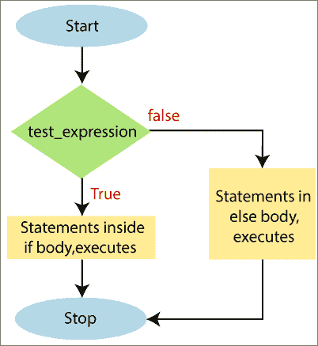

# 如果-否则语句

> 原文：<https://www.javatpoint.com/powershell-if-else-statement>

当我们需要在条件为真或条件为假时执行语句块时，我们必须使用 **if-else** 语句。

如果布尔表达式条件的计算结果为真，那么将执行“**”if**主体中的语句。如果条件评估为假，那么将执行“ **else** 体内的语句。

## If-Else 语句的语法

```powershell

If(test_expression)
     {
              Statement-1
              Statement-2.......
              Statement-N
      }
else
     {
              Statement-1
              Statement-2.......
              Statement-N
      }

```

## If-Else 语句流程图



## 例子

**以下示例说明了如何在 PowerShell 中使用 if-else 语句:**

**示例 1:** 在本例中，我们可以检查变量中的数字是偶数还是奇数。如果是偶数，则打印**偶数**，否则打印**奇数**。

```powershell

PS C:\> $a=15
PS C:\> $c=$a%2
PS C:\> if($c -eq 0)
>> {
>> echo "The number is even"
>> } else
>> {
>> echo "The number is Odd"
>> }

```

**输出:**

```powershell
The number is Odd

```

**例 2:** 在本例中，我们将检查数字是负数还是正数。

```powershell

PS C:\> $a=-10
PS C:\> if($a -lt 0){
>> echo "The entered number is negative"
>> }else
>> {
>> echo "The entered number is positive"
>> }

```

**输出:**

```powershell
The entered number is negative

```

**示例 3:** 在本例中，我们将检查一个人是否有资格投票。

```powershell

PS C:\> $age=19
PS C:\> if($age -ge 20)
>> {
>> echo "A person is eligible for voting."
>> } else
>> {
>> echo "A person is not eligible to vote."
>> }

```

**输出:**

```powershell
A person is eligible for voting. 

```

**示例 3:** 在本例中，我们将检查两个变量中最大的数字。

```powershell

PS C:\> $n1=150
PS C:\> $n2=200
PS C:\> if($n1 -gt $n2)
>> {
>> echo " The value of variable n1 is greater."
>> } else
>> {
>> echo " The value of variable n2 is greater."
>> }

```

**输出:**

```powershell
The value of variable n2 is greater.

```

* * *