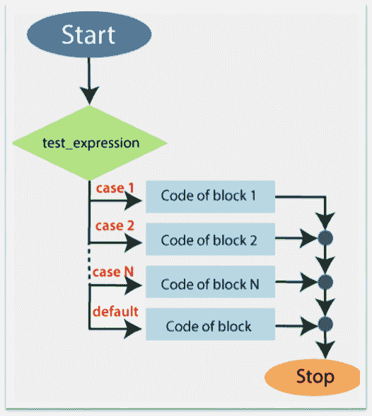

# 交换语句

> 原文:[https://www.javatpoint.com/powershell-switch-statement](https://www.javatpoint.com/powershell-switch-statement)

当您需要检查 PowerShell 中的多个条件时，我们必须使用 Switch 语句。

PowerShell 中的这个语句相当于一系列的“**”If 语句，但是使用起来很简单。该语句列出了每个条件以及与每个条件相关联的块代码。如果某个条件为“**真**，则该代码块将在该特定条件下执行。**

 **## Switch 语句的语法

```

 Switch (<test-expression>)
{
     <condition1> { Code of Block-1 ; break }
     <condition2> { Code of Block-2 ; break }
     <condition3> { Code of Block-3 ; break }
      .
      .
      .
     <condition3> {Code of Block-N ; break }
}

```

以下是适用于**开关**语句的规则:

*   **默认的**语句是可选的。即使这个语句没有默认语句，它也可以毫无问题地执行。
*   **test_expression** 可以是逻辑表达式，也可以是整数表达式。
*   如果**中断**语句应用于任何**情况**，则**开关**语句被该情况之后的**中断**语句终止。

## 切换语句流程图



## 例子

**下面的例子描述了如何使用 switch 语句:**

**例 1:** 在本例中，日数值与其中一个数值相匹配。

```

PS C:\> $day=3
PS C:\> switch($day)
>> {
>> 1{echo "The day is Sunday"}
>> 2{echo "The day is Monday"}
>> 3{echo "The day is Tuesday"}
>> 4{echo "The day is Wednesday"}
>> 5{echo "The day is Thursday"}
>> 6{echo "The day is Friday"}
>> 7{echo "The day is Saturday"}
>> }

```

**输出:**

```
The day is Tuesday

```

**示例 2:** 在本例中，我们检查变量的值是 10、50 还是 100。如果这些值都不匹配，则执行默认语句。

```

PS C:\> $x=3
PS C:\> switch($x)
>> {
>> 10{echo "The Number is equalt to 10"}
>> 50{echo "The Number is equal to 50"}
>> 100{echo "The Number is equal to 100"}
>> default {" The Number is not equal to 10, 50, and 100."}
>> }

```

**输出:**

```
The Number is not equal to 10, 50, and 100.

```

**示例 3:** 在本例中，我们说明了如何使用 switch 语句，并将数组作为输入:

```

PS C:\> $m=4
PS C:\> $a=13
switch($m,$a)
>> {
>> 1{echo "January"}
>> 2{echo "February"}
>> 3{echo "March"}
>> 4{echo "April"}
>> 5{echo "May"}
>> 6{echo "June"}
>> 7{echo "July"}
>> 8{echo "August"}
>> 9{echo "September"}
>> 10{echo "October"}
>> 11{echo "November"}
>> 12{echo "December"}
>> Default { echo " You give a Wrong number"}
>> }

```

**输出:**

```
April
You give a Wrong number

```

* * ***