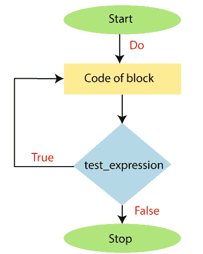
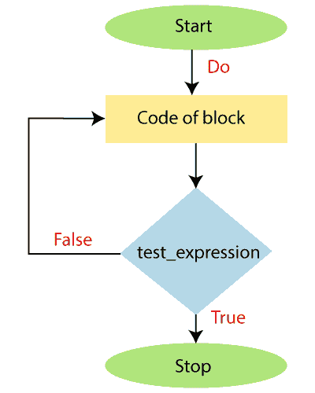

# 边做边循环

> 原文：<https://www.javatpoint.com/powershell-do-while-loop>

当我们需要至少运行一次循环时，我们在一个 PowerShell 中使用 **Do-while** 循环。

Do-While 循环是一种循环结构，在这种结构中，在执行语句后对条件进行评估。该循环也称为**出口控制**循环。

do-while 循环与 while 循环相同，但在块中执行语句后，总是检查 **do-while** 循环中的条件。

Do 关键字还与“**”关键字一起使用，以运行脚本块中的语句。像边做边循环一样，**边做边直到**循环也在条件评估前至少执行一次。**Do-直到**循环在代码块中执行其语句，直到条件为假。当条件为真时，循环将终止。**

 **我们可以在“边做边做”或“直到做”循环中使用“中断并继续”等流量控制关键字。

## 句法

下面的块显示了 **Do-while** 循环的语法:

```

Do
{
        Statement-1
        Statement-2
        Statement-N 
} while( test_expression)

```

下面的块显示了**Do-直到**循环的语法:

```

Do
{
        Statement-1
        Statement-2
        Statement-N 
} until( test_expression)

```

## 边做边循环的流程图



## 直到循环的流程图



## 例子

**以下示例描述了如何在 PowerShell 中使用边做边做直到循环:**

**示例 1:** 在本例中，我们打印 1 到 10 之间的整数值。

```

PS C:\> $i=1
PS C:\> do
>> {
>> echo $i
>> $i=$i+1
>> }while($i -le 10)

```

**输出:**

```
1
2
3
4
5
6
7
8
9
10

```

**示例 2:** 在本例中，我们将使用 Do 直到循环来打印数组的值。

```

PS C:\> $array=1,2,3,4,5,6,7
PS C:\> $i=0
PS C:\> do{
>> echo $array[$i]
>> $i=$i+1
>> } until ($i -eq $array.length)

```

**输出:**

```
1
2
3
4
5
6
7

```

**示例 3:** 在本例中，我们使用 **Do-while** 循环打印 5 的表格。

```

PS C:\> $table=5
PS C:\> $i=1
PS C:\> do
>> {
>> echo " $table * $i = $res"
>> $i=$i+1
>> }while($i -le 10)

```

**输出:**

```
5 * 1 = 5
5 * 2 = 10
5 * 3 = 15
5 * 4 = 20
5 * 5 = 25
5 * 6 = 30
5 * 7 = 35
5 * 8 = 40
5 * 9 = 45
5 * 10 = 50

```

在本例中，我们使用 **Do-while** 循环打印了 5 的乘法表。首先，我们创建并初始化了一个变量**$表**和 **$i** ，其值分别为 5 和 1。然后我们写了一个边做边循环。

在一个循环中，我们有一个 echo 命令，它将打印 **$res** 的结果，该结果存储了$table * **$i** 的乘法。

每次将变量 **$i** 的值增加 1，检查条件。当变量 **$i** 的值变为 11 时，条件变为**假**，循环终止。

* * ***