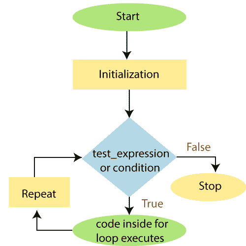

# 用于循环

> 原文：<https://www.javatpoint.com/powershell-for-loop>

在 PowerShell 中， **For 循环**也被称为“ **For** ”语句。当特定条件评估为真时，此循环执行代码块中的语句。这个循环主要用于检索数组的值。

## For 循环的语法

```powershell

for (; <condition or="" test_expression="">; <repeat>)
{
   Statement-1
   Statement-2
   Statement-N
}</repeat></condition> 
```

在本语法中，**初始化**占位符用于用初始值创建和初始化变量。

循环中的**条件**占位符给出布尔值**真**或**假**。每次执行此循环时，PowerShell 都会评估条件部分。当它返回真值时，将执行命令块中的命令或语句。循环执行其块，直到条件变为假。

循环中的重复占位符表示一个或多个由逗号分隔的命令。它用于修改在循环的条件部分检查的变量值。

## For 循环的流程图



## 例子

**示例 1:** 以下示例描述了如何在 PowerShell 中为循环使用“**”:**

```powershell

for($x=1; $x -lt 10; $x=$x+1) 
>>  { 
>> echo $x 
>>     }

```

**输出:**

```powershell
1
2
3
4
5
6
7
8
9

```

在本例中，变量 **$x** 被初始化为 1。评估小于 10 的测试表达式或条件$x。因为小于 10 的 1 为真，所以执行 for 循环中的语句，该语句打印 1(x 的值)。

执行重复语句 **$x=$x+1** 。现在,$x 的值是 2。同样，测试表达式被评估为 true，并且 for 循环中的语句被执行并将打印 2(值$x)。再次执行 repeat 语句，并评估测试表达式 **$x -lt 10** 。这个过程一直持续到$x 变成 9。当 x 的值变为 10 时，$x < 10 将为假，并且的“**循环终止。**

**示例 2:** 以下示例描述了在 PowerShell 中打印数组字符串值的循环:

```powershell

PS C:\> $arrcolors = "Red","Orange","Green","White","Blue","Indigo","black","Violet"
PS C:\> for($i=0; $i -lt $arrcolors.Length; $i++) 
>>  { 
>> $arrcolors[$i]
>>     }

```

**输出:**

```powershell
Red
Orange
Green
White
Blue
Indigo
black
Violet

```

**示例 3:** 以下为循环的**示例，重复显示变量的相同值，直到您按下键: **PowerShell** 中的: **ctrl+C** 。**

```powershell

PS C:\> $j = 10
PS C:\> for (;;)
>> {
>>     echo $j
>> }

```

**输出:**

```powershell
10
10
10
10
10
10........................

```

**示例 4:** 以下示例以表格形式打印从 1 到 30 的偶数和奇数。

```powershell

PS C:\> for($i=1;$i -le 30;$i++){
>> if($i -le 1)
>> { 
>> echo "Even   -   Odd"
>>}
>> $res=$i%2
>> if($res -eq 0)
>> {
>> echo "  $i          "
>> }else
>> {
>> echo "           $i"
>> }
>> }

```

**输出:**

```powershell
Even   -   Odd
                1
  2
                3
  4
                5
  6
                7
  8
                9
  10
                11
  12
                13
  14
                 15
  16
                 17
  18
                 19
  20
                 21
  22
                 23
  24
                 25
  26
                  27
  28
                  29
  30

```

* * *