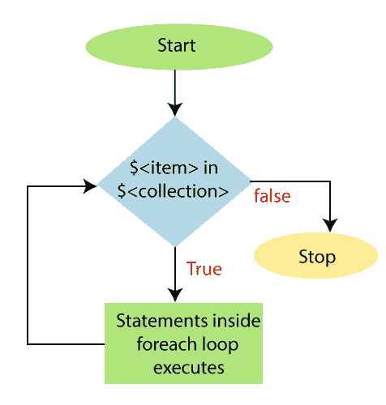

# ForEach 循环

> 原文：<https://www.javatpoint.com/powershell-foreach-loop>

**Foreach 循环**在 PowerShell 中也被称为 **Foreach 语句**。 **Foreach** 是一个关键字，用于循环遍历一个数组或一组对象、字符串、数字等。这个循环主要用于我们需要一次处理一个对象的情况。

## 句法

以下块显示了 **Foreach** 循环的语法:

```powershell

Foreach($ in $<collection>)
   {
         Statement-1
         Statement-2
         Statement-N
    }</collection> 
```

在该语法中， **<项>** 是变量或对象的单个值，其在每次迭代中变化。 **<集合>** 是您想要访问的数字和字符串的数组或集合。当此循环执行时，PowerShell 会自动创建变量 **$ <项>** 。语法中有一个块，它包含为集合中的每一项执行的单个或多个语句。

## ForEach 循环的流程图



## 例子

**示例 1:** 以下示例使用 **foreach** 循环显示数组的值:

```powershell

PS C:\> $Array = 1,2,3,4,5,6,7,8,9,10
PS C:\> foreach ($number in $Array)
>> {
>> echo $number
>> }

```

**输出:**

```powershell
1
2
3
4
5
6
7
8
9
10

```

在本例中，创建了一个数组 **$Array** ，并用整数值 **1，2，3，4，5，6，7，8，9，10** 进行初始化。Foreach 语句第一次执行时，会将数组的整数值“ **1** ”赋给 **$number** 变量。然后，它使用 echo cmdlet 显示数字 1。下一次通过循环时，$number 被设置为 2，以此类推。Foreach 循环显示数字 10 后，PowerShell 终止循环。

**示例 2:** 以下示例使用 **foreach** 循环显示文件夹中的文件:

```powershell

PS C:\> foreach($file in get-childitem)
>> {
>>  echo $file
>> }

```

**输出:**

```powershell
     Directory: C:\
Mode                LastWriteTime         Length Name
----                -------------         ------ ----
d-----       23-02-2019     13:14                found.000
d-----       28-12-2017     19:44                Intel
d-----       04-07-2018     10:53                Office 2013 Pro Plus
d-----       15-09-2018     13:03                PerfLogs
d-----       09-10-2019     11:20                powershell
d-r---       22-08-2019     15:22                Program Files
d-r---       03-10-2019     10:23                Program Files (x86)

```

在本例中， **foreach** 语句显示了由 **get-childitem** cmdlet 返回的项目(文件)列表。

**示例 3:** 以下示例使用 foreach 循环显示数组的值:

```powershell

PS C:\> $fruits= "apple", "orange", "guava", "pomegranate", "Mango"
PS C:\> foreach ($item in $fruits)
>> {
>> echo $item
>> }

```

**输出:**

```powershell
apple
orange 
guava
pomegranate
Mango

```

* * *