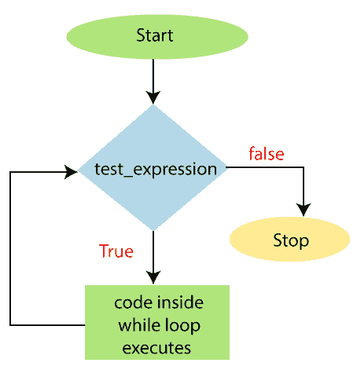

# While 循环

> 原文:[https://www.javatpoint.com/powershell-while-loop](https://www.javatpoint.com/powershell-while-loop)

在 PowerShell 中， **While 循环**也被称为 **While** 语句。这是一个入口控制的循环。当特定条件评估为真时，此循环执行代码块中的语句。这个循环比语句的**更容易构建，因为这个循环的语法没有那么复杂。**

## While 循环的语法

```

while(test_expression)
{
     Statement-1
     Statement-2
     Statement-N
}

```

当我们执行 **while 循环**时，PowerShell 首先评估条件。然后，它执行代码块中的语句。该条件返回**布尔**值**真**或**假**。直到条件为真，PowerShell 重复执行这些语句。当条件返回假时，循环将终止，控制转到循环后的语句。

## While 循环流程图



## 例子

**示例 1:** 以下示例使用 while 循环打印从 1 到 5 的值:

```

PS C:\> while($count -le 5)
>> {
>> echo $count
>> $count +=1
>> }

```

**输出:**

```
1
2
3
4
5

```

在本例中，条件($count 小于等于 5)为真，而$count = 1，2，3，4，5。每次循环时，变量$count 的值都会使用(+=)算术赋值运算符递增 1。当$count 等于 6 时，条件语句的计算结果为 **false** ，循环退出。

**示例 2:** 以下示例求前 n 个自然数的和:

```

PS C:\> $n=10
PS C:\> $i=1
PS C:\> $sum=0
PS C:\> while($i -le $n)
>> {
>> $sum=$sum+$i
>> $i=$i+1
>> } echo $sum

```

**输出:**

```
55

```

在本例中，**和**循环被执行 n 次。每次，变量 **$i** 的值被添加到 **$sum** 变量中，并且 **$i** 的值被增加 1。

**示例 3:** 以下示例使用 while 循环打印一个数字的阶乘:

```

PS C:\> $fact =5
PS C:\> $f =1
PS C:\> while($fact -gt 0)
>> {
>> $f = $f *$fact
>> $fact -=1
>> } echo $f

```

**输出:**

```
120

```

* * *