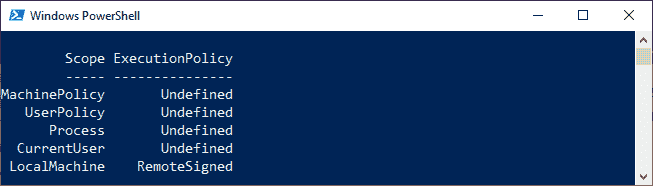

# PowerShell 执行策略

> 原文：<https://www.javatpoint.com/powershell-execution-policy>

执行策略是 PowerShell 的特性，它指定了 PowerShell 加载配置文件和运行脚本的条件。

在 Windows 操作系统上，我们可以为当前用户、本地计算机或特定会话设置执行策略。当前用户和本地计算机的执行策略存储在注册表中，对于特定的会话，执行策略仅存储在内存中，当会话关闭时，内存将丢失。

在非 Windows 操作系统上，默认执行策略是不受限制的。而且这个政策不能不变。

## PowerShell 执行策略

**以下是 PowerShell 执行策略:**

*   全部签名
*   忽视
*   远程签名
*   受限制的
*   不明确的
*   无限制的

**全部签名**

*   只有那些由受信任的发行者用数字签名签名的脚本才能运行。
*   在运行脚本之前，此策略会提示您确认是否信任发布者。

**旁路**

*   在这项政策中，没有任何东西被封锁。
*   没有警告，或者没有提示。
*   旁路策略主要是为那些将 PowerShell 脚本构建到更大的应用程序中的配置而设计的。

**远程签名**

*   这是 Windows Server 计算机的默认执行策略。
*   此策略要求配置文件和脚本上的可信发布者的数字签名。这些文件和脚本是从互联网上下载的，包括电子邮件和即时通讯程序。
*   此执行策略不需要在本地计算机上编写的脚本上进行数字签名。

**受限**

*   默认情况下，此执行策略适用于 Windows 客户端计算机。
*   它不允许运行脚本，但允许单独的命令。

**未定义**

*   当前范围内没有定义执行策略。

**无限制**

*   这是非 windows 计算机的默认执行策略。
*   此策略执行那些未签名的脚本。

## 执行策略范围

以下是执行策略范围的有效值:

*   MachinePolicy
*   用户策略
*   过程
*   当前用户
*   本地机器

**机器**

此范围由组策略为所有计算机用户设置。

用户政策

此范围由组策略为计算机的当前用户设置。

**流程**

此范围仅影响 PowerShell 的当前会话。

当前用户

在此范围内，执行策略仅影响当前范围。

**局部机器**

在此范围内，执行策略影响当前计算机上的所有用户。

## 管理执行策略

*   我们可以使用以下 Cmdlet 来获取当前 PowerShell 会话的有效执行策略:

```

Get-ExecutionPolicy

```

*   我们可以使用以下命令获取影响当前会话的所有执行策略。并且，使用这个命令，我们按照优先顺序显示它们。

```

Get-ExecutionPolicy -list

```

上面命令的输出如下所示:



*   我们可以使用**-作用域**参数来获取特定作用域的执行策略。例如，以下命令获取**本地机器**范围的执行策略:

```

Get-ExecutionPolicy -Scope LocalMachine 

```

上述命令将显示输出为**远程签名**

## 更改执行策略

*   我们可以使用**Set-ExecutionPolicy**cmdlet 来更改 Windows 计算机上 PowerShell 的执行策略。您所做的更改会立即受到影响。您不需要重新启动 PowerShell 窗口。
*   如果您对范围 **CurrentUser** 和 **LocalMachine** 的执行策略进行了一些更改，这些更改将保存在注册表中，并且在您再次更改它们之前保持有效。
*   如果您对**进程**范围的执行策略进行了更改，则这些更改不会保存在注册表中。
*   以下块描述了用于更改执行策略的语法:

```

Set-ExecutionPolicy -ExecutionPolicy <PolicyName>

```

## 删除执行策略

我们可以通过将执行策略设置为**未定义**来删除特定范围的执行策略。

**示例:**本示例删除本地计算机所有用户的执行策略。

```

Set-ExecutionPolicy -ExecutionPolicy Undefined -Scope LocalMachine

```

* * *