# 获取日期格式

> 原文：<https://www.javatpoint.com/powershell-get-date-format>

在本文中，我们将讨论并使用 PowerShell 的**获取日期格式**(或*日期格式*)命令。日期和时间属性在整个 PowerShell 脚本中被多次使用。使用**获取日期** *小命令*，我们可以检索机器的当前日期。默认的日期格式是在运行该命令的本地系统上定义的。“获取日期”命令使用多种格式和参数。这里，我们将只关注格式并显示不同的日期结果。

在 [PowerShell](https://www.javatpoint.com/powershell) 上执行所有 Get-Date cmdlet 操作之前，我们必须知道如何启动 PowerShell 工具(应用程序)。

## 以管理员身份启动 PowerShell

以管理员身份启动 PowerShell 有多种方式；下面提到了一些基本方法:

### 1.使用 Windows 的搜索栏以管理员身份运行 PowerShell

**第一步:** Windows 10 操作系统自带任务栏中的搜索栏。将光标指向搜索栏，然后键入“powershell”(或 PowerShell)。

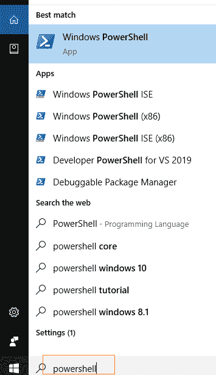

**第二步:**根据搜索结果，右键点击 **Windows PowerShell** 和**T5【以管理员身份运行】** 。它将带您进入 Windows PowerShell 的管理员模式。

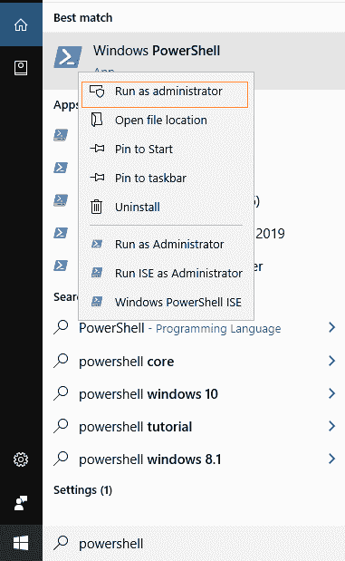

### 2.使用“运行”窗口以管理员身份运行 PowerShell

**第一步:**同时按下 **Windows + R** 键，会打开一个运行对话框。现在，在运行对话框中输入 **PowerShell** ，点击**确定**按钮。

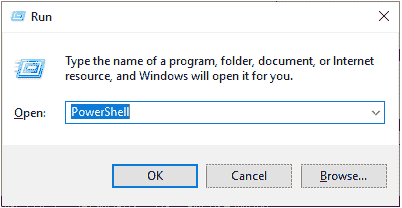

**步骤 2:** 步骤 1 为当前用户打开正常的 PowerShell 窗口。现在，在 PowerShell 窗口上，键入命令**开始-处理 PowerShell-动词 runas** 并按下“**回车”**键。

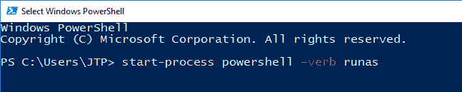

**第三步:**上面的命令要求你以管理员模式打开 Windows PowerShell 点击**确定**允许，将 Windows PowerShell 带给管理员。

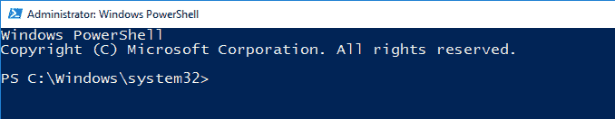

## 日期格式参数

以下是 PowerShell 中不同类型的日期格式:

*   显示提示
*   格式
*   不，不，不，不，不，不，不，不，不，不，不，不，不

## 何时使用获取日期

**获取日期**命令返回一个日期时间对象，该对象显示您在本地设备上指定的当前日期。让我们看看当我们使用 [**获取日期**](https://www.javatpoint.com/powershell-get-date) 命令时系统的默认格式。

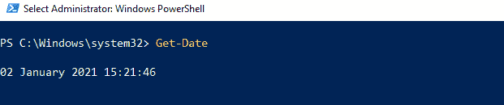

Get-Date 命令返回各种 UNIX 和的字符串类型的日期和时间值.NET 格式化字符串并将它移动到其他 cmdlets。

外壳屏幕上显示的输出格式基于您格式化的计算机设置。要查看您的设备日期设置，请使用 ***(获取文化)。*命令的日期时间格式；它将返回不同的日期和时间格式。**

```

(Get-Culture).DateTimeFormat

```

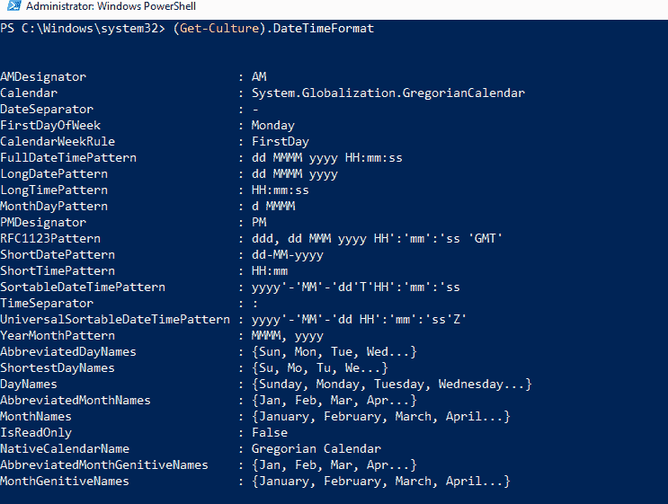

## 如何使用获取日期命令

命令**获取日期**返回系统的*当前日期和时间*，结果以长日期和长时间格式显示。


如果我们使用带有**获取日期**的**格式列表**小命令，我们将看到返回各种日期和时间格式的完整信息。获取日期命令返回一个日期时间对象。让我们看看使用**获取日期|格式-列表**小命令的输出:

```

Get-Date | Format-List

```

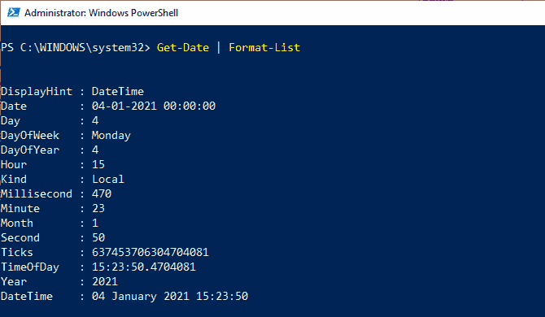

## 显示提示

**显示提示**参数定义了我们想要在屏幕上显示的信息类型。此参数还返回 DateTime 对象；但是，它有三种不同类型的格式，包括日期、时间和日期时间。***-显示提示*** 参数一次使用来自 ***【日期】【时间】*** 或 ***DateTime*** 的任何人。

*   **日期**:只返回当前日期值。
*   **时间**:只返回当前时间值。
*   **DateTime** :返回当前日期和时间值。

让我们看看使用以下 cmdlets 的输出:

```

Get-Date -DisplayHint Date
Get-Date -DisplayHint Time
Get-Date -DisplayHint DateTime

```

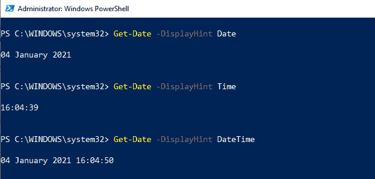

## 格式

使用 PowerShell 命令中的 **-Format** 参数，您可以以指定的特定格式显示日期和时间。-Format 参数接受微软允许的所有值.NET 框架并包含在 *DateTimeFormatInfo 类*中。有不同的格式选项，您可以根据自己的需要来设置日期和时间结果的格式。

#### 请注意，-Format 参数返回的结果不是 DateTime 对象；相反，它们将得到一个字符串结果。我们提到了微软提供的一些标准格式说明符信息及其简短描述。

### 标准字符串格式说明符

有些标准。最常用的. NET 字符串格式说明符定义如下:

| 分类符 | 描述 |
| 嗒嗒球拍 | 以全名返回一周中的一天 |
| 梅智节拍器 | 返回月号 |
| 截止日期（Deadline Date 的缩写） | 以两位数返回一个月中的某一天 |
| 年份 | 以 4 位数返回年份 |
| HH:mm | 以 24 小时格式返回时间，不带秒 |
| K | 返回相对于世界时坐标(UTC)的时区偏移量 |

**例如:**

让我们看一个例子，使用下面的- Format 参数和几个参数在. NET 格式说明符中检索 ***日期和时间*** .NET 格式说明符:

```

Get-Date -Format "dddd MM/dd/yyyy HH:mm k"

```

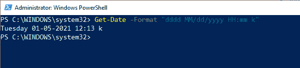

### 可选格式列表

| 日期 |
| d | 返回短日期模式 |
| D | 返回长日期模式 |
| f | 返回完整的日期/时间模式(短时间) |
| F | 返回完整的日期/时间模式(长时间) |
| g | 返回一般日期/时间(短时间) |
| G | 返回一般日期/时间(长时间) |
| M 或 M | 返回月日模式 |
| o | 返回往返日期/时间模式 |
| R 或 R | 返回 RFC1123 模式 |
| s | 返回可排序的日期/时间模式；符合国际标准化组织 8601 |
| 你还是你 | 返回可排序的日期/时间模式 |
| Y 还是 Y | 返回年月模式 |

| 时间 |
| t | 返回短时间模式 |
| T | 返回长时间模式 |

让我们一个接一个地应用下面的格式，看看它们的输出:

```

Get-Date -Format d
Get-Date -Format D
Get-Date -Format f
Get-Date -Format F
Get-Date -Format g
Get-Date -Format G
Get-Date -Format m
Get-Date -Format y

```

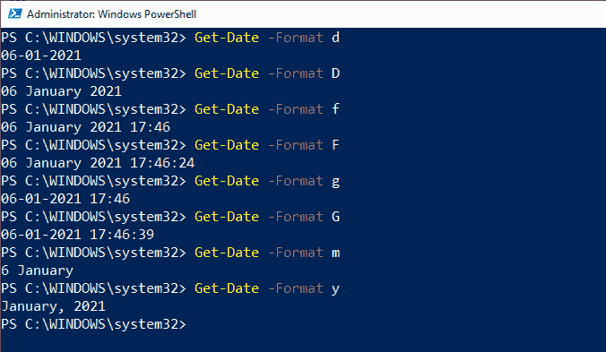

## 不，不，不，不，不，不，不，不，不，不，不，不，不

**ufformat**参数允许我们提到一种我们希望以 Unix 格式显示的格式。该格式命令的语法如下**获取-日期-格式%\ <值\>T3。小命令**-格式**总是以字符串值的形式返回输出。下面是与微软提供的-ufformat 参数一起使用的各种说明符列表及其描述。**

### 格式说明符列表

| **日期和时间** | c | 以缩写形式返回日期和时间(2021 年 1 月 6 日星期三 18:35:23) |
| **时间** | p | 上午或下午 |
| r | 以 12 小时格式(上午 08:24:43)返回时间 |
| 稀有 | 以 24 小时格式返回时间，不带秒(15:32) |
| t 或 X | 以 24 小时格式(15:32:43)返回时间 |
| Z | 从世界时坐标(UTC)返回时区偏移量 |
| **小时** | k 或 H | 以 24 小时格式返回小时(17) |
| I 或 L(大写‘I’，(小写 L) | 以 12 小时格式返回小时(05) |
| **分钟&秒** | M | 返回分钟(40) |
| S | 返回秒(04) |
| s | 返回自 1970 年 1 月 1 日 00:00:00 以来经过的秒数(1150451174.95705) |
| **日期** | D | 以 mm/dd/yy 格式返回日期(例如 01/18/21) |
| x | 以区域设置的标准格式返回日期(英语-美国为 06/12/21) |
| **月** | b 或 h | 以缩写形式返回月份名称(一月) |
| B | 完整返回月份名称(一月) |
| m | 返回月号(06) |
| **年** | C | 返回世纪(2021 年为 21) |
| g 或 y | 以 2 位数格式(21)返回年份 |
| g 还是 Y | 以 4 位数格式返回年份(2021) |
| **周** | u 或 W | 返回一年中的一周(00-52) |
| V | 返回一年中的一周(01-53) |
| **日** | a | 以缩写名称返回一周中的某一天(周一) |
| A | 以全名返回星期几(星期一) |
| u 或 w | 以数字形式返回星期几(星期一= 1) |
| d | 以 2 位数(05)返回一个月中的某一天 |
| e | 返回月中的某一天——数字前面有一个空格(5) |
| j | 返回一年中的某一天- (1-366) |
| **特殊字符** | n | 返回换行符(\n) |
| t | 返回制表符(\t) |

使用各种格式说明符的 get-Date with-ufformat 参数返回一个字符串输出。例如，查看以下-ufformat cmdlet 的结果:

```

Get-Date -UFormat "%A %m/%d/%Y %R %Z

```


下面定义了上述格式说明符如何返回字符串值:

| 分类符 | 定义 |
| %A | 以全名返回星期几(星期三) |
| %m | 返回月号(01) |
| %d | 以 2 位数(06)返回一个月中的某一天 |
| %Y | 以 4 位数格式返回年份(2021) |
| %R | 以 24 小时格式返回时间，不带秒(21:38) |
| %Z | 返回相对于世界时坐标(+05)的时区偏移量。 |

**计算并显示一年中的某一天(Get-Date-Year 2021-Month 12-Day 31)。大年初一**

为了计算一年中的日期，**获取日期**使用三个参数来确定日期。这些参数是**-年、【月】-T3、**-日**。它的命令被括在括号内，以便**dayfyear**属性计算输出结果。例如，计算一年中给定日期的总天数。**

```

(Get-Date -Year 2021 -Month 12 -Day 31).DayOfYear
(Get-Date -Year 2021 -Month 06 -Day 31).DayOfYear
(Get-Date -Year 2021 -Month 02 -Day 31).DayOfYear

```

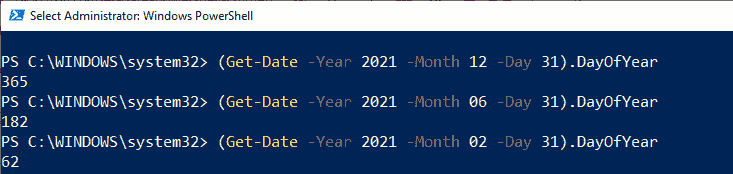

**检查日期是否调整为夏令时:**

要检查日期是否根据夏令时进行了调整，需要一个布尔方法。例如:

```

$DST = Get-Date
$DST.IsDaylightSavingTime()

```


在上面的命令中，我们使用了一个变量$DST 来存储 **Get-Date** 的结果。一个变量$DST 调用 **IsDaylightSavingTime()** 方法来测试日期是否根据夏令时进行了调整。

**将当前时间转换为世界协调时:**

**ToUniversalTime()** 方法用于将本地系统的当前时间转换为世界时坐标(UTC)。让我们看一个将当前时间转换为世界协调时偏移的例子。首先，我们会得到当前日期和时间与 UTC 之后，我们将其转换为世界时。

```

Get-Date -UFormat "%A %B/%d/%Y %T %Z"
$Time = Get-Date
$Time.ToUniversalTime()

```

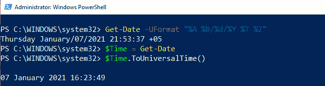

**获取日期**命令使用**-格式**参数和一些格式说明符来返回本地系统的当前日期和时间。格式说明符 **%Z** 指定 **+05** 的世界时坐标偏移量。

变量 **$Time** 存储由**获取日期**返回的当前日期和时间结果。返回值($Time)调用**到 UniversalTime()** 方法，将本地系统的当前日期和时间转换为 UTC 偏移。

### 使用获取日期格式创建时间戳:

要使用获取日期格式创建时间戳，让我们看下面的 cmdlet 示例:

```

$timestamp = Get-Date -Format o | ForEach-Object { $_ -replace ":", "." }
New-Item -Path D:\TestFolder\$timestamp -Type Directory

```

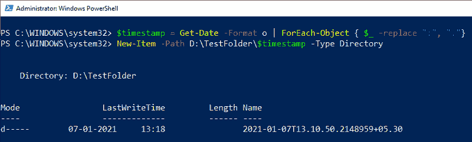

在上面的示例中，格式说明符为输入目录名创建了一个时间戳字符串对象。该时间戳包含日期、时间和世界协调时偏移值。

在上面的命令中，一个变量 ***$timestamp*** 存储了 ***Get-Date*** 命令的结果。 ***获取日期*** 使用格式参数和格式说明符 **o** ，以小写形式创建时间戳字符串对象。

对象通过管道发送回 ***ForEach-Object*** ，变量 ***$_*** 代表当前管道对象。时间戳字符串值由冒号指定，冒号由句点替换。

***新建-项目*** 使用***-路径*** 参数来确定新创建目录的位置。路径中包含的变量 ***$timestamp*** 代表目录名， ***-Time*** 参数表示创建了一个目录。

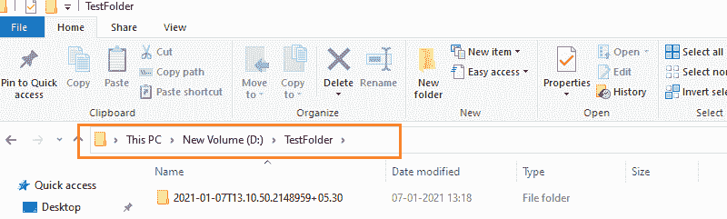

* * *