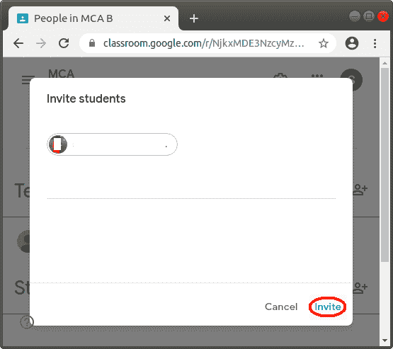

# 谷歌课堂教程

> 原文：<https://www.javatpoint.com/google-classroom>

## 什么是谷歌教室？

**谷歌教室**是由**谷歌**开发的免费网络工具。于 2014 年 8 月 12 日**发布。**

它主要由老师和学生使用，用于在他们之间共享文件。在谷歌教室里，老师可以为学生创建作业，也可以从他们那里收集作业。在这个应用程序中，教师和学生都可以不使用纸张工作。

制作谷歌教室的主要目的是以无纸化的方式创建、评分和分发作业。这个基于网络的应用程序还集成了谷歌的其他工具，如**谷歌驱动**和**谷歌文档**。

在这个应用程序中，学生和老师可以轻松地相互交流，教师也可以跟踪每个学生的进度。

这个应用程序使用谷歌驱动程序来创建和分发作业，使用谷歌文档来编写工作表和幻灯片，使用谷歌邮件来进行对话或交流，使用谷歌日历来安排日程。

## 谷歌教室的用途

**以下是谷歌教室的不同用途:**

*   这个工具用来在老师和学生之间分享作业。
*   这项服务还通过给作业评分来帮助老师，作业是由学生完成的。
*   在这个工具的帮助下，老师可以很容易地发布一个对整个班级都很重要的公告。学生可以通过邮件获得老师发布的公告。与其他网站不同，这个应用程序中的学生可以对公告进行评论。
*   教师可以轻松地以数字方式分发、组织和收集作业。教师也可以很容易地检查谁在给定的时间内完成了工作。
*   它允许教师在作业或公告中附加一个或多个视频。
*   谷歌教室允许每个学生用他们的信息制作幻灯片。并且，它还允许其他学生在其他学生的幻灯片上添加评论。
*   它还用于组织或创建具有到期日期的作业。
*   学生也可以通过谷歌教室提供的图标向老师发送邮件。
*   该工具允许学生访问教师或讲师提供的作业和学习材料。它还可以提供一个平台，帮助学生与老师和其他学生交流。

## 谷歌教室的特点

以下是谷歌教室的各种功能:

1.  分配
2.  通告
3.  沟通
4.  谷歌日历
5.  谷歌表单
6.  移动应用
7.  隐私

## 登录并设置一个谷歌教室

**签到**是师生进入谷歌教室的第一步。您只能在活跃的互联网连接上使用此服务。您可以使用以下类型的帐户登录教室:

1.  学校账户
2.  个人谷歌账户
3.  套房账户

### 在电脑系统或笔记本电脑上登录谷歌教室

如果您是教师或学生，并且使用的是笔记本电脑或电脑，则必须按照给定的步骤进行登录:

**第一步:**首先，你要点击系统中的浏览器图标，打开任意一个网页浏览器。我们已经在系统中打开了谷歌浏览器，如下图所示。

**第二步:**现在，你需要在网页浏览器的地址栏中输入**Classroom.google.com**的网址，如下图所示。输入网址后，按回车键。

**第三步:**现在，点击**前往教室**按钮。

**第 4 步:**现在，在**电子邮件或电话**栏中输入您的谷歌账户的电子邮件地址，然后点击**下一步**按钮。

**第五步:**现在，你要输入你谷歌账号的密码。并且，再次点击**下一步**按钮。

**第六步:**点击后，您成功登录**谷歌教室**。您也可以在电脑屏幕上看到相同的页面，如下图所示。

### 在安卓手机上登录谷歌教室

如果您是教师或学生，并且您必须在您的安卓设备上使用谷歌课堂，首先您必须使用以下两个步骤下载并安装课堂应用程序:

1.  在你的安卓设备中，点击**谷歌 Play 商店**应用。
2.  找到**谷歌教室**应用，点击**安装**按钮。一段时间后，**谷歌教室**应用成功安装在你的安卓设备上。

下载并安装谷歌教室应用程序后，您必须按照给定的步骤登录谷歌教室:

**第一步:**在你的安卓设备上点击**教室**应用。

**第二步:**现在，点击**开始**按钮。

**步骤 3:** 现在，点击**添加账户**选项，在谷歌教室中添加谷歌账户。现在，点击**确定**按钮

**第四步:**现在，你要输入你的谷歌账号的邮箱地址。现在，点击**下一步**按钮。

**第五步:**在这个屏幕上，你需要输入你的谷歌账号的密码。现在，再次点击**下一步**按钮。

**第六步:**点击后，您成功登录安卓设备上的**谷歌教室**。你也可以在你的安卓设备上看到相同的屏幕，如下图所示。

## 探索谷歌教室的主屏幕

下面的屏幕是谷歌教室的主页，由以下功能组成。老师和学生都可以看到这个页面。

1.  教室菜单
2.  创建或加入一个类
3.  谷歌应用
4.  帐户设置
5.  帮助和反馈

## 创建一个类

如果你是一名教师，你必须使用谷歌教室与你的班级学生分享作业，那么首先你必须在谷歌教室注册后创建一个班级。

当您成功登录谷歌教室后，您必须按照给定的步骤创建一个班级:

**第一步:**点击 **+(添加)**按钮，位于谷歌教室主页右上角，如下图所示。

**第二步:**选择并点击**【创建类】**按钮。

**第三步:**现在，选择复选框按钮，点击**继续**按钮。

**第四步:**点击后，需要输入如下截图所示的四个字段。

**第五步:**我们输入类名。需要填写**类名**字段。你必须给出对你和你的学生有意义的班级名称。

**第六步:**填写类名后，我们填写小节。要填写区段字段，点击**区段**，并输入详细信息。此字段是可选的。

**第 7 步:**现在，我们通过点击**主题**来填充主题。此字段也是可选的，您可以在此字段中输入值，也可以不输入值。

**第八步:**现在，我们输入上课学生所在的房间号。该字段也是可选的。

**第九步:**最后点击**创建**按钮。

单击后，您的课程将由谷歌教室自动创建，您将在计算机上看到相同的屏幕，如下图所示:

创建课程后，代码由谷歌教室自动生成，这有助于您的学生加入课程。此外，你还可以很容易地邀请你班上的学生在谷歌课堂上分享通知和作业。

## 加入一个班级

如果你是一名学生，你必须加入由你的老师创建的班级。首先，你必须在谷歌教室里通过你的活动邮件标识进行注册。

您可以很容易地使用以下两种方法加入一个类:

1.  使用类代码加入类。
2.  接受老师的邀请。

### 使用类代码加入类

班级代码是由谷歌教室在您的老师创建班级时自动创建的代码。你的老师给了你这个加入班级的代码。

当您成功登录谷歌教室时，您必须遵循给定的步骤，在给定的课程代码的帮助下加入课程:

**第一步:**点击 **+(添加)**按钮，位于谷歌教室主页右上角，如下图所示。

**第二步:**选择并点击**【加入班级】**按钮。

**第三步:**现在，输入老师给的班级代码。然后，点击**加入**按钮。

**第四步:**点击后，你成功加入由你的老师创建的班级。而且，你可以收到作业和通知。当您在一台设备上成功加入谷歌课堂的任何课程时，您将自动在运行谷歌课堂的所有设备上注册该课程。

### 接受邀请加入班级

你也可以接受老师的邀请，轻松地加入这个班。

当您成功登录谷歌课堂后，您必须按照给定的步骤接受邀请加入课堂:

**第一步:**打开你的账户，你的老师会在上面发出邀请。

**第二步:**点击邮件，点击加入按钮。

**第三步:**点击后，你成功加入了一个班级，这个班级的邀请是由你的老师发出的。

## 邀请学生去上课

如果你是一名教师，你必须邀请你的学生加入一个班级，那么你必须遵循给定的步骤:

**第一步:**首先，用你的谷歌教室 id 登录**谷歌教室**。

**第二步:**然后，点击位于**谷歌教室**屏幕右上角的**教室菜单**中的**班级**选项卡。

**第三步:**现在，点击要添加学生或学生组的班级。

**第四步:**现在点击**人物**标签，出现在屏幕顶部，如下图截图所示:

**第五步:**然后点击**邀请学生**按钮，如下图截图所示:

**第 6 步:**现在，输入或键入学生或小组的电子邮件地址。然后，点击搜索结果。之后，点击**邀请**按钮。

**第七步:**如果想邀请更多的同班同学，按照第五步、第六步进行。

**第八步:**邀请发送给学生后，则被邀请的学生显示在**学生**列表中，如下图截图所示。

## 将学生从班级中移除

如果你是一名教师，你必须让一名学生离开你在谷歌教室的班级，那么你必须遵循给定的步骤:

**第一步:**首先，用你的谷歌教室 id 登录**谷歌教室**。

**第二步:**然后，点击位于**谷歌教室**屏幕右上角的**教室菜单**中的**班级**选项卡。

**第 3 步:**现在，点击您想要移除学生的班级。

**第四步:**现在点击**人物**标签，出现在屏幕顶部，如下图截图所示:

**第 5 步:**现在，点击要移除的学生旁边的复选框。

**第六步:**现在，点击**动作**。然后，点击**移除**按钮。

**第七步:**点击后会出现确认对话框，再次点击移除按钮。

**第八步:**然后，你看到这个学生成功的被开除了。

## 存档一个类

如果你是一名教师，你想知道如何在谷歌教室中存档或隐藏课程，那么你必须学习这一部分。

当任何一节课被归档时，该课也会为所有注册该课的学生和老师归档。如果您想再次使用存档的类，也可以恢复该类。

现在，您必须按照给定的步骤来归档您的**谷歌教室**中的任何课程:

**第一步:**首先，用你的谷歌教室 id 登录**谷歌教室**。

**第二步:**然后，点击位于**谷歌教室**屏幕右上角的**教室菜单**中的**班级**选项卡。

**第三步:**现在，点击你想要存档的那张职业卡片中的更多选项。

**第 4 步:**然后，点击下拉列表中的存档选项。单击后，您必须单击确认对话框中的存档按钮。

**第五步:**之后，你的课成功存档。您也可以从教室菜单中的**存档课程**选项卡中恢复。

## 删除一个类

如果你是一名教师，你想知道如何从谷歌教室中删除一个班级，首先你必须学会如何存档一个班级，因为任何班级只有在存档后才能被删除。

以下步骤用于删除类:

**第一步:**首先，用你的谷歌教室 id 登录**谷歌教室**。

**第二步:**然后，点击位于**谷歌教室**屏幕右上角的**教室菜单**中的存档课程选项卡。

**第三步:**现在，点击你要删除的那张类卡的更多选项。

**第 4 步:**然后，点击下拉列表中的删除选项。单击后，您必须单击确认对话框中的删除按钮。

**第五步:**之后，你的类被成功删除。

## 创建分配

如果你是一名教师，你想为谷歌教室的一个班级的学生创建作业，那么你必须学习这一部分。

阅读本节后，您可以轻松创建具有以下各种功能的作业:

*   将作业发布到一个或多个课程。
*   将作业发布给一个班级的单个学生
*   通过添加到期日期和时间来发布分配。
*   通过添加附件发布分配。

要在谷歌教室中创建作业，请遵循以下步骤:

**第一步:**首先，用你的谷歌教室 id 登录**谷歌教室**。

**第二步:**然后，点击位于**谷歌教室**屏幕右上角的**教室菜单**中的**班级**选项卡。

**第三步:**现在，点击你想在其中创建作业或向学生发布作业的班级。

**第四步:**之后，点击**课堂**选项卡，该选项卡位于屏幕顶部的**流选项卡**旁边，如下图所示:

**第五步:现在，**点击**创建**按钮，然后点击下拉列表中的**分配**选项。

**第六步:**点击后，我们将进入如下画面，在该画面中，我们必须通过点击**标题**来输入作业的标题。并且，如果你想给出如何完成作业的指令，那么点击**指令(可选)**输入指令。

**第七步:**如果你想**给一个或多个班级**发作业，那么你必须按照下面给出的两个步骤去做。否则，转到步骤 8:

**第一步:**首先点击**向下箭头▼** 按钮，位于**下方。我们在下面的截图中描述了它:**

**

**第二步:**点击后，通过点击复选框选择您想要分享或发布作业的课程。

**第八步:**如果你想**把作业发给个别学生**，那么你必须遵循下面给出的两个步骤。否则，转到步骤 9。一次，你只能给一个班级不到 100 个学生分配作业。

**第一步:**首先点击**【全体同学▼】**按钮，如下图截图所示:

**第二步:**点击后，分别选择你要发布作业的学生。您必须取消选择**所有学生**选项。

**第九步:**如果你想**通过添加截止日期和时间**来发布任务，那么你必须遵循下面给出的三个步骤。否则，转到步骤 10。

**第一步:**首先点击按钮向下箭头 **▼** ，在**【到期】**下。我们在下面的截图中描述了它:

**第二步:**现在再次点击**旁边的向下箭头 **▼、**无预产期**。

然后选择并点击日历中的特定日期。

**第三步:**也可以设置时间，点击**时间(可选)**。通过指定**上午**或**下午**输入时间。

**第十步:**如果你想**给你的作业**增加一个话题，那么你必须按照下面给出的两个步骤来做。否则，转到步骤 11。我们只能给一个作业指定一个主题。

**第一步:**首先点击**【话题】**下的按钮向下箭头 **▼** 。我们在下面的截图中描述了它:

**第二步:**现在，点击创建主题选项，输入主题名称。之后，该主题将成功添加到您的作业中。

**第 11 步:**如果你想**把附件添加到你的作业**中，那么你必须学会这一步。否则，转到步骤 12。你可以很容易地从你的电脑和谷歌驱动器添加文件，链接和视频的 YouTube。

### 从您的计算机添加文件

按照给定的步骤从设备将文件添加到您的作业中:

**第一步:**点击**添加**按钮。然后点击下拉列表中的**文件**选项。

**第二步:**从设备中选择文件后，点击**上传**按钮上传文件。

### 从你的谷歌驱动器添加一个文件

按照给定的步骤从**谷歌**驱动器将文件添加到您的作业中:

**第一步:**点击**+添加**按钮。然后点击下拉列表中的**驱动**选项。

**第二步:**从 Google drive 中选择项目后，点击**添加**按钮添加文件。

### 添加链接

按照给定的步骤在作业中添加链接:

**第一步:**点击**+添加**按钮。然后点击下拉列表中的**链接**选项。

**第二步:**现在，输入网址，然后点击**添加链接**按钮。单击后，该链接将成功添加到您的任务中。

### 添加 YouTube 视频

按照给定的步骤在作业中添加 YouTube 视频:

**第一步:**点击**+添加**按钮。然后点击下拉列表中的 **YouTube** 选项。

**第二步:**在搜索栏输入视频名称，点击搜索按钮。

**第三步:**搜索完毕后，点击想要附加的视频，然后点击**添加**按钮。

**第 12 步:**在这一步，你要点击**创建**按钮。然后，根据你的需要选择选项。成功创建分配后，点击位于屏幕右上角的**分配**按钮。

完成所有步骤后，作业会发布到学生教室，每个被选中的学生都会收到作业电子邮件通知。并且，作业显示在谷歌教室的“流”页面上，如下图所示:

## 删除分配

如果你是一名教师，你想删除谷歌课堂的作业，那么你必须按照下面给出的步骤去做。从课程中删除任何作业时，与该作业相关的所有注释和等级都会自动删除。

**第一步:**首先，用你的谷歌教室 id 登录**谷歌教室**。

**第二步:**然后，点击位于**谷歌教室**屏幕右上角的**教室菜单**中的**班级**选项卡。

**第 3 步:**现在，点击要删除现有作业的班级。

**第 4 步:**之后点击分类工作标签。然后，点击更多按钮。

**第五步:**选择并点击下拉列表中的**删除**选项。

**第 6 步:**再次点击**删除**按钮确认。然后，你的作业就成功地从你的课堂上删除了。

## 发布公告

如果你是一名教师，你想在谷歌教室的一个班级里向学生发布公告，那么你必须学习这一部分。

您可以通过以下各种功能轻松发布公告:

*   将公告发布到一个或多个班级。
*   将公告发布给一个班级的单个学生
*   通过添加附件发布公告。

要向谷歌教室中的学生发布公告，请遵循以下步骤:

**第一步:**首先，用你的谷歌教室 id 登录**谷歌教室**。

**第二步:**然后，点击位于**谷歌教室**屏幕右上角的**教室菜单**中的**班级**选项卡。

**第三步:**现在，点击你要向学生发布公告的班级。

**第四步:**在流的页面点击**和你的班级**分享一些东西，如下图截图所示。

**第五步:**之后，在框内输入公告，然后点击**发布**按钮。

**第六步:**点击后发布公告。

## 谷歌教室的优势

以下是谷歌教室的各种优势:

1.  这个工具对老师和学生来说都很容易使用和理解。
2.  老师和学生
3.  老师们可以很容易地在这个平台上建立班级。在建立一个班级后，他们也可以邀请学生和其他合作老师。
4.  这个工具允许老师跟踪班上每个学生的进度。
5.  通过这个工具，老师和学生也可以访问谷歌的其他产品。
6.  谷歌教室允许学生随时随地与老师和其他学生互动。
7.  这是免费的。老师和学生可以在互联网连接的帮助下轻松访问它。为了访问它，老师和学生不需要任何平台。
8.  这个工具完全无纸化；因此，它减少了学生和老师的文书工作。
9.  老师和学生在谷歌教室中完成的工作会自动保存在谷歌云中，可以随时从任何设备轻松访问。
10.  老师和学生也在移动设备上使用这个工具。当老师在此工具中发布任何作业或公告时，学生会在手机上收到通知。
11.  老师也可以为学生创造一个问题。

## 谷歌教室的缺点

以下是谷歌教室的限制或缺点:

1.  这个工具没有与谷歌挂机集成，这就造成了沟通上的问题。
2.  这个工具的一大缺点是它不支持自动测试和测验。

* * ***