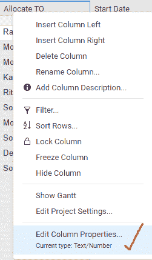
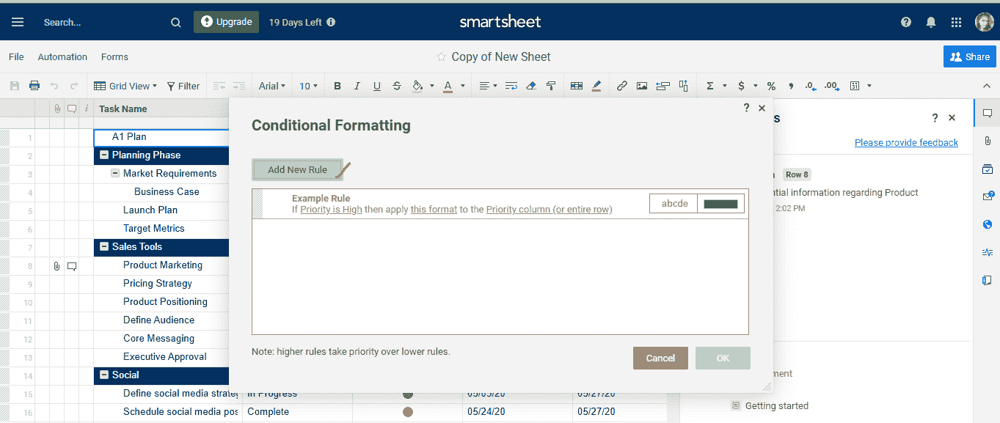
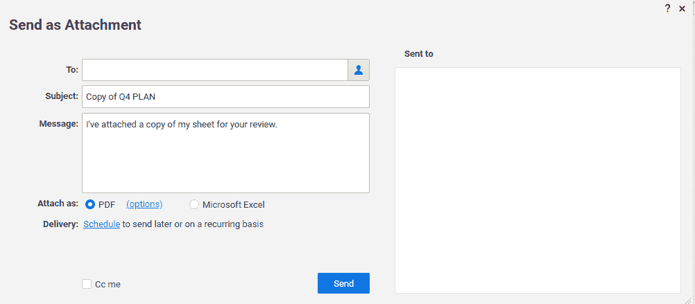
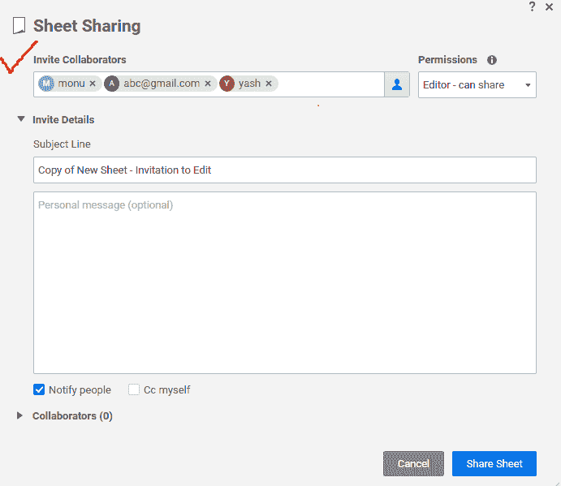

# SMARTSHEET 教程

> 原文：<https://www.javatpoint.com/smartsheet>

*   Smartsheet 是由 ***Smartsheet Inch*** 开发的在线 ***项目管理*** 工具。
*   智能表单是为工作管理和协作提供的软件即服务(SaaS)。
*   Smartsheet 是一款基于云的*项目管理工具，其设计方式使得大量员工可以轻松使用。*

 *在我们的智能表单教程中，我们将讨论以下主题-

*   [什么是智能表单](#What)
*   [智能表单做什么](#do)
*   [智能表单的优势](#Advantages)
*   [智能表单的缺点](#Disadvantages)
*   [如何开始在智能表单上工作](#Start-Working)
*   [如何创建新的智能表单](#Create-New)
*   [如何重命名工作表中的项目](#Rename-Item)
*   [如何修改表单的规则权限设置](#Modify-Rule)
*   [数据和格式选项](#Data-and-Formatting)
*   [如何保存工作表数据](#Save-Sheet)
*   [如何刷新表单](#Refresh-Sheet)
*   [行和层次结构](#Rows-and-Hierarchy)
    1.  [如何缩进一行](#Indent)
    2.  [行和层次结构](#Rows-and-Hierarchy)
    3.  [移除层级](#Remove-Hierarchy)
*   [柱型参考](#Column-Type-Reference)
    1.  [如何编辑列以更改其类型](#Change-its-Types)
    2.  [创建列描述](#Create-Column-Description)
    3.  [编辑栏目描述信息](#Edit-Column-Description)
    4.  [如何在表单中设置下拉栏](#Set-up-Dropdown-Column)
    5.  [如何编辑下拉栏属性](#Edit-Dropdown-Column)
*   [智能表单中的附件](#Attachments)
    1.  [如何从在线资源附加文件或链接](#Attach-File-or-Link)
    2.  [智能表单中附件支持的文件类型](#Supported-File-Types)
    3.  [基于用户&上传方式的最大文件大小](#Maximum-File-Sizes)
*   [智能表单中的对话](#Conversations)
    1.  [在工作环境中进行对话](#Conversations-in-the-Context)
    2.  [在工作表(网格视图或卡片视图)中与注释交互](#Interact-with-Comment)
    3.  [创建应用于整个智能表单的新注释](#Create-New-Comment)
    4.  [如何回复现有评论](#Reply-Existing-Comment)
    5.  [编辑、发送电子邮件、打印或删除评论](#Edit-E-mail-Print-or-Delete-Comment)
    6.  [使用文件附件为注释提供上下文](#Give-Context-to-Comments)
    7.  [如何删除附加到注释的文件](#Attached-to-a-Comment)
    8.  [如何从评论面板中删除附件](#Comment-Panel)
*   [智能表单中的条件格式](#Conditional-Formatting)
    1.  [如何创建条件格式规则](#Create-Conditional-Formatting)
    2.  [如何设置规则的条件](#Set-Conditions)
    3.  [设置规则的格式](#Set-Format)
    4.  [格式化选项](#Formatting-Options)
    5.  [添加条件、克隆或重新排列规则](#Condition-Clone-or-Rearrange)
    6.  [删除或禁用条件格式规则](#Delete-or-Disable)
*   [配方基础](#Formula-Basics)
    1.  [在智能表单中创建和编辑公式](#Create-and-Edit-Formula)
    2.  [功能](#Functions)
    3.  [编辑现有公式](#Edit-Existing-Formula)
    4.  [通过拖动填充或自动填充复制公式](#Copy-Formula)
    5.  [限制配方奶粉使用的区域](#Areas-where-Formula)
*   [智能表单中的共享](#Sharing)
    1.  [共享智能表单项目](#Share-Item)
    2.  [更多共享选项](#Sharing-Options)
    3.  [如何共享工作区中的项目](#Workspace)
    4.  [如何设置默认共享视图](#Default-Sharing)
*   [联系人](#Contacts)
    1.  [如何将联系人添加到我的智能表单联系人中](#Add-Contacts)
    2.  [单独添加联系人](#Contacts-Individually)
    3.  [如何编辑或删除智能表单中的联系人](#Edit-or-Delete-Contacts)
    4.  [如何从智能表单联系人列表中导出联系人](#Export-Contact)
*   [智能表单中的组](#Groups)
    1.  [如何在智能表单中创建组](#Create-Group)
    2.  [如何管理现有组](#Manage-Existing-Group)
    3.  [编辑组](#Edit Group)
    4.  [如何与群组共享智能表单项目](#Share-Smartsheet-Item)
*   [智能表单中的卡片视图](#Card-View)
*   [基本甘特图](#Basic-Gantt-View)
*   [日历视图](#Calendar-View)
*   [打样](#Proofing)

* * *

## 什么是智能表单

Smartsheet 是一个在线项目管理工具，用于任务分配、日历管理、共享文档、跟踪项目进度以及处理其他工作。智能表单由 ***智能表单公司*** 开发。

Smartsheet 是一个基于云的工具，也是一个用于项目管理的电子表格工具。Smartsheet 与各种任务管理产品竞争，如***【Asana】******Trello***。

## 智能表单是做什么的

在智能表单中，我们使用称为表单的电子表格。电子表格像智能工作表一样执行每一项任务，但是智能工作表和电子表格之间有一些区别，例如智能工作表包含所有包含在其中的协作功能，这超出了标准的电子表格功能。

智能表单执行各种任务:

1.  合作
2.  设置警报
3.  附加文件
4.  进行讨论
5.  请求更新
6.  设置 web 表单
7.  发布工作表

**1。协作:-** 在 Smartsheet 中，协作意味着我们还可以邀请项目团队的其他成员在一张表上进行协作。这意味着他们有权编辑和查看工作表。

**2。设置提醒:-** 设置提醒是指在表单中，我们可以为任务设置提醒和通知。

**3。附加文件:-** 在智能表单中，我们可以将文件附加到一行或整个表单。文件存储在 smartsheet 的服务器上，当我们登录 smartsheet 并查看工作表时，可以访问这些文件。

**4。有讨论:-** 我们也可以设置关于整个项目或者几个任务的讨论。讨论的细节保存在表中。

**5。请求更新:-** 请求更新意味着我们可以请求协作者更新分配给协作者的作业进度。

**6。设置网络表单:-** 智能表单提供设置网络表单的功能。在这种情况下，我们可以设置反馈表单，以及用户给出的响应。它可以自动填充到图纸中。

**7。发布工作表:-** 我们可以通过外部网址提供该工作表，以便其他人可以看到该工作表。

## 智能表单的功能

smartsheet 有各种功能，这使得项目跟踪和协作变得容易。

1.  共享工作表
2.  合作
3.  机动性
4.  提醒和提醒
5.  共享工作区
6.  权限级别
7.  上传文件
8.  查看更改历史记录
9.  高级报告
10.  通过电子邮件发送和接收更新
11.  发送工作表

**共享工作表:-** 在智能工作表中，我们可以共享和管理任何种类的工作。还有，用户没有限制。我们可以邀请一定数量的用户编辑和查看您的工作表。

**协作:-** 无论是特定任务的协作还是与同事共享工作，协作在智能表单中都很容易，因为所有的项目信息和所有关联的文件注释都放在一个集中的位置。

**移动性:-** Smartsheet 通过编辑任务、创建项目以及使用任何设备(笔记本电脑、PC、电话等)与团队成员合作来提高工作效率。)用互联网信号。在 smartsheet 中，用户可以即时添加文件、查看附件，还可以随时随地对通知采取行动，这有助于了解每个人的项目状态。

**提醒和提醒:-** 在智能表单中，有一个自动提醒和提醒功能，为所有即将到来的作业和临近的截止日期提供了自动提醒和提醒的功能，使所有团队成员都能轻松跟踪所有到期日期。所以，就这样，所有的任务都按时完成了。简化工作流程并使之现代化也很有帮助。

**共享工作区:-** 智能表单提供了在客户、内部团队成员和合作伙伴之间安全协作的工具。通过共享文件夹和工作表，其他人可以轻松设置。

**权限级别:-** 权限级别是指与工作区、行和工作表相关的控制访问权限。

**上传文件:-** 在智能表单中，我们可以轻松地将文件上传到工作区、行或表单。

**查看变化历史:-** 我们可以看到床单的变化历史，以及是谁做的变化。

**高级报告:-** 在 Smartsheet 的帮助下，我们可以快速制作一份报告，检查事情的进展，并检查工作的绩效。

**通过电子邮件发送和接收更新:-** 在智能表单中，人们无需登录即可通过电子邮件更新您的表单。

**发送表单:-** 我们可以很方便的将表单以 **PDF** 或 **Excel** 附件的形式发送。

## 目标市场

Smartsheet 可由任何人或任何企业使用，无论企业规模大小。

各种著名客户包括:

*   网飞
*   加拿大白鲑
*   搜索范围
*   包厢
*   希尔顿
*   百色熊
*   世界展望会
*   惠好公司
*   国际项链
*   Veritiv

## 智能表单的优势

smartsheet 有多种优势:

1.  简单的用户界面
2.  甘特图的可用性
3.  高效的移动应用
4.  出色的卡片视图

**1。简单的用户界面:-** 与电子表格相比，智能表单设计简单、整洁、专业。

**2。甘特图的可用性:-** 甘特图有助于估计工作进度。在甘特图的帮助下，我们可以很容易地检查谁在做一项特定的任务，以及他们是什么时候完成这项任务的。

**3。出色的移动应用:-** 智能表单包含令人难以置信的移动应用功能。Smartsheet 是一个用户友好的工具。Smartsheet 是为 iOS 和安卓设备设计的。

**4。优秀的卡片视图:-** 每个项目管理软件都不包含卡片视图，但大多数项目管理软件都致力于提供卡片视图的功能。

## 智能表单的缺点

智能表单有各种缺点:

1.  **缺乏时间跟踪功能:-** 在每个项目管理软件中，时间跟踪是必不可少的功能。智能表单项目管理工具中没有这种功能，它依赖于第三方集成。
2.  **并非所有 Excel 公式都可以在智能表上工作:-** 智能表上的另一个缺点是有几个 Excel 公式在智能表上不起作用。

## 如何开始使用智能表单

登录智能表单有多种步骤:

**第一步。**如果我们想使用智能表单，我们有很多登录选项可以登录到智能表单。此外，我们可以通过注册创建一个帐户。但是在本教程中，我们将通过谷歌帐户登录。所以，访问以下链接[https://app.smartsheet.com](https://app.smartsheet.com)。

**第二步。**当我们点击链接时，会打开一个登录页面，如上图所示。我们必须在电子邮件地址和密码的帮助下登录。

**第三步。**如上图成功登录我们的 smartsheet 账户后，会打开一个仪表盘，我们就可以开始工作了。

## 如何创建新工作表

要创建新项目，我们必须遵循以下步骤:

**第一步。**首先，我们必须点击**菜单**图标(菜单图标位于智能表单窗口的左上角)。

**第二步。**点击**菜单图标后，**点击**创建**选项。

#### 注意:项目名称必须包含最多 50 个字符。

**第三步。**接下来，我们要选择我们想要创建的工作表的标题，在选择了工作表的标题之后，我们可以开始在工作表中填充项目，这样我们的第一张工作表就创建好了

#### 注意:我们创建的工作表只有在与他人共享后才能被他人看到。

## 如何重命名工作表中的项目

要重命名智能表单中的项目，我们必须遵循各种步骤:

**第一步。**要重命名一个项目，右键单击要重命名的项目，然后选择**重命名**选项。下图显示了重命名项目的图示:

**第二步。**点击重命名选项后，输入我们想要重命名的该项目的新名称，然后点击确定。下图显示了重命名后的项目:

## 智能表单项目概述

1.  **网格:**网格不包含任何预定义的列。网格是一块干净的石板，当我们从头开始时，我们使用网格。
2.  **任务列表:-** 任务列表包含各种预定义的列，如任务名称、分配给、到期日、状态和注释。
3.  **表单:-** 在智能表单中，我们制作了一个三列表单和一个附加在该表单上的表单。当我们知道如何用表单从其他人那里收集数据时，我们就使用这个表单。
4.  **Report: -** Report 用来生成一个报表，让我们可以查看项目的绩效和职位。
5.  **仪表板/门户:-** 使用仪表板/门户，我们可以创建工作表数据的可视化摘要。

## 如何创建图纸副本

创建图纸副本有不同的步骤:

**第一步。**要创建一张图纸的副本，选择我们要复制的图纸，选择图纸后，它将打开。点击**文件**并选择**另存为新的**显示**另存为新的**窗口。

**第二步。**接下来，我们必须在“命名您的工作表”下键入新工作表的名称，如下所示:

**第三步。**在**下的**中，我们可以选择要保存复印纸张的文件夹或位置。

**第四步。**接下来，我们有三个选项，即**共享选项、自动化工作流&提醒选项和数据&格式化选项。**我们可以通过点击选择其中一个选项。然后，选择我们希望与工作表副本一起保存的项目。

**第三步。**点击**保存**按钮。

## 如何修改工作表的规则权限设置。

*我们用它来控制谁可以从表单接收通知和请求。*

我们必须按照以下步骤修改工作表的规则权限设置:

**第一步。**首先，我们点击菜单栏上的**自动化**选项。

**第二步。**接下来，我们点击**管理工作流。**

**第三步。**接下来，要修改自动化窗口中的权限级别，单击窗口右上角的**设置**图标。

**第四步。**点击设置图标后，权限级别页面打开，之后可以修改表单的自动化权限设置。

**第五步。**最后，我们必须从给定选项**(受限、受限、无限制)**中选择一个选项，当我们选择该选项时，单击**确定**。

## 数据和格式选项

数据和格式选项中有各种可用选项:

1.  工作表数据和格式
2.  评论
3.  附件
4.  单元格链接
5.  工作表链接
6.  工作表过滤器
7.  形式

**1。工作表数据和格式:-** 工作表数据和格式包含我们可以在单元格中键入的信息，以及应用于单元格的有关手动格式的信息。

**2。注释:-** 注释包括所有行注释和表级注释。

**3。附件:-** 附件包括所有行和表级的附件。

**4。小区链接:-** 小区链接包括 ***进站*** 小区链接。c

**5。图纸超链接:-** 图纸超链接包含其他图纸的超链接。

**6。片状过滤器:-** 片状过滤器包含片状过滤器。

**7。表单:-** 表单包含附加到表单的表单。

## 如何保存工作表数据

我们可以执行各种操作来保存工作表数据:

1.  保存工作表数据，我们可以使用快捷键**Ctrl+S**[Windows](https://www.javatpoint.com/windows)**Cmd+S**Mac。
2.  我们还可以使用自动保存选项。自动保存，需要点击**账户>个人设置>设置。**
3.  如果我们想从智能表单外部保存表单，请将表单导出为您选择的任何格式，然后我们可以从智能表单外部保存表单。

## 如何刷新工作表

我们可以通过执行以下步骤来刷新工作表:

1.  点击**文件**
2.  单击文件选项后，选择刷新选项并刷新工作表。

## 行和层次结构

在工作表中，行是必不可少的元素。行包括任务名称、客户名称、订单信息等信息。在一行中，我们还可以添加一些信息，如注释和附件。在一行中，有一个提醒，我们可以使用它来跟踪基本项目，如到期日。在智能表单中，信息也可以在发送行选项的帮助下共享，对于行项目的更新，我们可以向团队成员请求。

Smartsheet 提供了一个极好的缩进工具功能。借助缩进工具，我们可以创建行层次结构。因此，在一个项目中，我们不是使用数百行，而是压缩数据，这样我们就可以只关注特定的方面。

## 层次结构:缩进或突出显示行

缩进行意味着在工作表中建立层次结构。如果我们缩进一行，它将成为它上面的行的子行。我们只能从子行创建层次结构；这意味着我们不能从父行生成层次结构。

### 如何缩进一行

我们使用不同的步骤来缩进一行:

**第一步。**要缩进一行，请选择要缩进的行。然后右键单击该行。在下图中我们可以很容易地看到，我们选择了一个名为 ***的行*** 的业务案例。

**第二步。**接下来，我们点击**缩进**选项

**第三步。**现在，我们可以在下图中看到，该行是缩进的，并且已经成为该行的子行，在其上方。

## 删除层次结构

***移除层次意味着升级一行*** 。

删除层次结构有不同的步骤:

**第一步。**要删除层次结构，请选择要删除层次结构的行。在下图中，我们可以很容易地看到我们选择了一个名为**商业案例**的行。

**第二步。**然后，右键单击要升级或删除层次结构的行中的单元格，并单击**升级** t 选项。

**第三步。**我们可以很容易地在下图中看到删除层次或升级一行后的行。

### 层次结构最佳实践

使用层次结构时，我们必须记住一些要点:

*   缩进没有限制。我们可以根据需要将其应用于任意数量的行。
*   如果我们想删除父行，我们还必须删除缩进的子行。这意味着我们不能删除父行而不删除子行，子行是缩进的。
*   如果我们单击包含其下项目的行，子行将与我们选择的项目一起移动。

## 列类型引用

智能工作表中的列与电子表格中的列相同，只是智能工作表列包含一些独特的功能，使智能工作表更加强大和简单。列类型是指允许输入到列中的数据类型。在智能表单中，我们使用可配置列和默认列。

*   **默认列:-** 我们不能删除或更改的列称为默认列。在每张纸上都有主列。主列是必需的，我们不能从工作表中删除主列。
    列值是该行的关键描述符。该列包含文本/数字类型。
    我们使用各种类型的列显示图标来提醒某些特定于行的活动:
    1.  **用于附件的图标:-** 每行包含一个附件图标。通过使用这个，我们可以很容易地在行中附加一些附件。如果我们想查看附件，请点击图标。
    2.  **用于评论的图标:-** 每行包含一个评论项目。注释图标用于注释。如果我们想查看评论，那么我们必须点击评论图标。
    3.  **用于行操作指示器的图标:-** 行操作指示器图标用于显示与该行链接的更新请求、待定提醒、分配警报和锁定的图标。
*   **主柱:-** 我们不能改变的柱称为主柱。主列是具有数字或文本类型的列。
*   **可配置列:-** 在智能表单中，有各种类型的可配置列:
    1.  文本/数字
    2.  联系人列表
    3.  日期
    4.  下拉列表(单选)
    5.  下拉列表(多选)
    6.  检验盒
    7.  标志
    8.  自动编号/系统
        1.  **文本/数字:-** 文本/数字列类型包括文本值、数值或两者的组合，即文本和数值。对于注释，文本/数字是最佳选择。对于项目费用，数字类型是最佳选择。
        2.  **联系人列表:-** 联系人列表列类型用于存储所有者、分配给等值。借助联系人列表列类型，我们可以轻松联系协作者。除此之外，联系人列表列类型还有助于 ***发送提醒******生成报告*** ，该报告由分配给单个团队成员的任务列表组成。
            如果我们使用联系人列表列类型，通过使用不同的选项，我们可以在值框中定义所选的联系人值。联系人姓名和电子邮件地址是联系人列表可接受的值。

            
            在联系人列表中，我们还可以设置首选联系人，只需点击下拉箭头即可快速访问联系人。
        3.  **日期:-** 在日期列的单元格中，有一个日历图标。通过点击日历图标，我们可以轻松选择一个特定的日期。如果我们想手动输入日期，也可以在日期栏中输入。日期列类型有助于在日历视图中显示项目。
            智能表单中有各种格式的日期。我们可以借助 smartsheet 帐户中的个人设置来设置日期格式。

            
        4.  **下拉列表(单选):-** 下拉列表包含值列表。我们从值列表中选择一个值。
            如果我们想从下拉列表中删除任何项目，首先选择我们想删除的项目，然后点击删除按钮或退格键。

            
        5.  **下拉列表(多选):-** 下拉列表(多选)包含值列表。我们可以从值列表中选择多个值。当我们使用下拉列表(多选)选项时，我们可以在列表中键入要使用的值。

            
        6.  **复选框:-** 复选框列包含复选框，可以选中也可以不选中。
        7.  **符号:** **-** 在符号表中，存在视觉图像。符号列用于指定行的状态。在符号列中，我们不能手动添加任何符号。
        8.  **自动编号/系统:** **-** 自动编号/系统是自动生成每行值的列类型。当我们需要输入零件号、发票号、行标识、客户号等值时，我们使用自动编号/系统。

## 如何编辑列以更改其类型

如果我们想要修改现有的列属性，我们必须遵循以下步骤:

**第一步:**首先，点击下拉箭头。列标题下有下拉箭头。

**步骤 2:** 接下来，选择编辑列属性。

**步骤 3:** 然后，我们可以更改现有列的属性

## 创建列描述

创建列描述有不同的步骤:

**第一步:**首先，右键点击列标题，选择**添加列描述。**

**第二步。**然后会出现列描述窗口。最后，我们可以创建列描述。

## 编辑列描述信息

编辑列描述信息有不同的步骤:

**第一步。**首先，右键点击列标题，然后点击名为**的选项*编辑列描述*T5。**

**第二步。**接下来，在列描述窗口中修改所需的更改，并点击**确定**按钮。

## 如何在工作表中设置下拉栏

在工作表中设置下拉栏有不同的步骤:

**第一步。**首先，点击列标题下方的下拉箭头。然后根据需要选择*插入右栏或*插入左栏。

**步骤 2:** 接下来，我们必须在 **Nam** e 框中键入列的名称。

**第三步。**选择列类型，下拉(单选)或下拉(多选)。

**第四步。**接下来，根据需要在“值”框中键入值，这意味着我们想要获得的值的类型出现在列表中。

**第五步。**点击**确定**按钮。

## 如何编辑下拉列属性

编辑下拉列属性意味着从下拉列表中添加或删除值。

编辑下拉列属性有不同的步骤:

**第一步。**首先，点击下拉箭头，选择 ***编辑列属性*** 选项。

**第二步。**接下来，更改值框中存储的列出的值。如果要从下拉列表中删除该值，则选择要删除的值，然后按 ***删除*** 和 ***退格*** 。

**第三步。**然后，点击**保存**按钮。

### 使用下拉栏时的一些重要提示:

在使用下拉列表栏时，我们应该记住几个要点:

1.  在多选下拉列表中，我们可以选择任意数量的值。
2.  自由文本值按字母顺序存储在它们所添加到的单元格末尾的多选下拉列中。

## 智能表单中的附件

在智能表单中，我们可以轻松地管理和附加表单中的文件，以便可以在一个位置访问所有工作。在桌面和云存储提供商的帮助下，我们可以轻松地附加文件。Smartsheet 中的附件功能可帮助我们将所有项目相关信息保存在一个位置。

### 将存储在计算机上的文件附加到图纸上

在智能表单中，每种文件都可以附加到表单、行或注释中。在我们希望将文件与我们在智能表单中跟踪的项目相关联的情况下，这很有帮助。

在智能表单中，我们可以附加存储在计算机上的文件或存储在云上的文件。

### 如何从在线资源附加文件或链接

我们可以在工作区、工作表、行和注释的帮助下附加文件。

所以，让我们一个一个地讨论这些。

1.  **从工作区附加文件:-** 首先，从工作区，单击名为附件的图标，该图标位于工作区的右上角。然后，我们可以轻松地附加文件。
    T3】
2.  **工作表附件:-** 对于工作表附件，打开我们要添加附件的工作表，再次单击位于工作表右侧的附件图标。然后，单击名为**的选项，将文件附加到图纸上。**
    
3.  **行附件:-** 在表格中出现的行上，单击名为**附件**的图标，并根据要求
    附加附件

### 行级附件的行为

行级附件的行为是:

*   一次只能在一行中附加文件。
*   如果文件已经附加到某一行，则附件图标将显示在行号的左侧。
*   如果有一个文件已经附加到任何行，那么我们不能将该文件附加到工作表的另一行或任何区域。

**3。评论附件:-** 连续有一个评论图标，我们要点击评论图标，之后还要点击添加附件选项。

## 智能表单中附件支持的文件类型

智能表单中有多种支持附件的文件类型:

| 文件类型 | 扩展示例 |
| 微软办公套件 | . pptx、. xlsx、. docx |
| 大多数图像格式 | 。png 文件扩展名为. png 文件扩展名为. png 文件扩展名为. png 文件扩展名为. png 文件扩展名为. png 文件扩展名为. png 文件扩展名为. png 文件扩展名为 gif 文件格式。jpg 格式 |
| 可移植文档格式 | 。可移植文档格式文件的扩展名（portable document format 的缩写） |

## 支持的浏览器和上传数量

*   一次，我们可以上传 100 个文件。在智能表单中，文件附件没有限制。我们可以在行或表上附加任意数量的文件。但是存储空间的大小是有限制的。
*   如果浏览器支持 HTML 5，我们只能上传大小超过 30 MB 的文件。

## 不支持的文件类型

由于一些安全问题，智能表单不支持某些类型的文件。例如:在智能表单中，我们无法上传。exe 文件(可执行文件)。

## 基于用户和上传方法的最大文件大小

| 上传的用户或类型 | 最大文件大小 |
| 任何从智能表单上传文件的人 | 30 MB |
| 免费用户 | 250 兆字节 |
| 试用用户 | 30 MB |
| 许可用户 | 250 兆字节 |

## 智能表单中的对话

Smartsheet 提供了一个精彩的对话功能。借助对话功能，我们可以轻松管理我们的工作，并且它提供了所有协作者之间关于工作的有效沟通。

通过使用@提，用户可以直接回复邮件。这节省了时间，因为不需要在应用程序之间切换。

## 在你的工作环境中进行对话

对话提供了对工作的简单跟踪，关于工作的讨论也可以在一个地方完成。我们可以根据需求将对话应用于特定行或整个工作表。在对话面板中，我们可以使用评论。

如果我们想对一个特定的人进行直接评论，那么我们必须在评论部分输入@ <email address="">(例如，@javatpoint.com)来标记这个人。</email>

## 与工作表中注释的交互

在智能表单中，表单、行和卡片的所有注释都可以在对话面板中找到。如果我们想查看对话，我们必须单击右侧面板中的对话图标。

在对话中，所有的评论都是根据日期按时间顺序出现的。

在处理评论时，我们必须记住各种提示:

*   如果我们想查看不同的注释集合，请单击面板顶部的全部。如果我们想只显示那些应用于整个工作表的注释，那么我们单击工作表。
*   如果我们想去评论所在的那一行，首先，我们必须点击行号，然后点击在对话面板中写评论的那个人的名字。

## 为行创建新注释(网格视图或卡片视图)

*   如果我们想为任何一行写评论，那么在该行的评论栏中，我们必须点击**添加评论**

    
*   如果我们想为特定的卡片写评论，那么我们必须右键单击卡片，然后单击评论选项。

    

## 创建应用于整个图纸的新注释

当我们需要与工作表相关的一般对话时，我们使用工作表注释。它不是用于特定的行，而是用于整个工作表。

在整张纸上创建新注释有不同的步骤:

**第一步。**首先，点击对话图标，该图标位于右侧面板。

**第二步。**接下来，在**中输入评论，添加评论框。**

**第三步。**最后，点击名为**的选项发布评论**，然后按回车键。

## 如何回复现有评论

我们必须执行各种步骤来回复现有评论:

**第一步。**点击对话面板中的**回复**选项。

**第二步。**然后，在回复框中输入回复。

**第三步。**最后，点击帖子评论图标。

## 编辑、发送电子邮件、打印或删除评论

如果我们想要编辑、发送电子邮件、打印或删除评论，请点击对话面板右侧的**更多选项**图标。

## 使用文件附件为注释提供上下文

如果我们想给评论一些额外的上下文，那么我们可以在评论中添加一些附件。要给评论添加附件，点击名为**附件**的图标。附件图标位于添加注释框的最下方。

## 从注释中删除附件

从注释中删除附件有多种步骤:

**第一步。**首先，从包含附件的评论中，单击对话面板右侧的菜单图标，然后选择名为编辑评论的选项。

**第二步。**接下来，我们要把鼠标移到附件上，然后点击删除选项，这样文件就被删除了。

**第三步。**最后，我们必须点击保存选项，以便保存更改。

## 如何删除附加到注释的文件

我们无法从“附件”面板中删除附加到注释的文件。如果我们想删除文件，我们只有一个选择:我们必须从注释本身删除文件，或者我们可以删除文件所附的注释。

## 如何从注释面板中删除附件

从注释面板中删除附件有不同的步骤。

**第一步。**首先，点击评论面板右侧的**更多选项**图标。

**第二步。**选择名为**的选项编辑评论。**

**第三步。**接下来，我们要将鼠标移到我们想要删除的附件上，然后点击垃圾桶图标。

## 智能工作表中的条件格式

在智能表单中，条件格式用于在表单上创建规则。因此，条件格式帮助我们在表单上创建规则。由于条件格式，工作表单元格的外观发生了变化。

### 如何创建条件格式规则

创建条件格式规则有不同的步骤:

**第一步。**首先，在工具栏上，我们必须点击**条件格式**图标，以便显示条件格式窗口。

**第二步。**接下来，要创建新的条件格式规则，单击名为**的选项添加新规则。**

### 如何设置规则的条件

设置规则的条件有不同的步骤:

**第一步。**首先，点击**设置条件**选项，显示设置条件窗口。

#### 注意:标准因列的类型而异。例如:如果列类型是日期，那么我们只能根据日期应用格式，日期意味着过去的日期或未来几天的日期。如果列是复选框类型，那么我们只能在复选框或未复选框的基础上应用格式。

**第二步。**如果我们想再次自定义规则，那么点击已定义的自定义条件选项。

**第三步。**如果我们想在未应用条件的行上显示格式，那么选择复选框以在不满足条件时使用格式。

**第四步。**接下来，当所有条件都设置好了，然后点击确定。

### 设置规则的格式

设置规则的格式有不同的步骤:

**第一步。**要先设置规则的格式，从条件格式窗口，我们要点击**这个格式的选项**。下图显示了格式化选项在窗口中的显示方式:

我们可以根据需求应用格式，这意味着我们只能对行中的特定列或整行使用格式。如果我们没有定义格式化发生时的限制，那么默认情况下，格式化将应用于整行。

**第二步。**接下来，点击确定。

## 格式选项

下表显示了我们用于格式化的各种格式选项:

| 选项名称 | 选项的使用 |
| 字体类型和字体大小 | 字体类型用于设置字体的类型，如 Arial、Times、Verdana、Tahoma 或 Auto。字号用于改变字体的大小。 |
|  | 字体使用粗体、斜体、下划线和删除线。 |
| (背景) | “背景”选项用于将背景颜色应用于单元格。 |
|  （色源） | 用于对字体应用颜色 |

## 添加条件、克隆或重新排列规则

### 添加条件

添加条件有不同的步骤:

**第一步。**首先，在工具栏上，点击**条件格式**图标。

**第二步。**然后，要查看附加选项，请单击出现在条件格式窗口中规则左侧的下拉箭头。

**第三步。**接下来，选择添加条件(添加)向规则添加条件。

添加条件(与)规则用于在规则中应用“与”运算符，这表明要应用的格式应满足各种条件。

### 克隆规则

克隆规则意味着复制现有规则，以便在类似的新规则中使用。如果我们想要克隆一个规则，请单击该规则左侧的下拉列表，然后选择克隆的规则。

### 重新排列规则

如果我们想以特定的顺序执行规则，那么我们可以重新排列规则。因此，要重新排列规则，请在列表中向上或向下单击并拖动规则。

### 删除或禁用条件格式规则

删除或禁用条件格式规则有多种步骤:

**第一步。**首先，在工具栏上，点击条件格式图标。当我们单击条件格式图标时，将出现所有现有规则的列表。

**第二步。**接下来，选择以下选项之一:

*   **暂时关闭:**如果我们想以后使用现有规则，我们使用**禁用**选项。如果我们想禁用规则，点击下拉箭头并选择**禁用规则。**如果我们想再次使用我们禁用的规则，点击选项**启用规则。**

    
*   **完全删除规则:**如果我们想永久删除规则，那么使用选项**完全删除规则。**要使用此规则，我们必须点击下拉箭头并选择删除规则选项。

    

## 配方基础

Smartsheet 提供了公式工具，以便我们可以执行计算。我们可以将公式应用于数值和单元格中包含的值。在公式的帮助下，我们还可以自动化符号和下拉字段。

### 在智能表单中创建和编辑公式

在智能工作表中，公式用于计算数值和自动处理工作表。

### 创建公式

我们使用各种文件类型来创建公式:

*   文本/数字
*   联系人列表字段
*   日期
*   控件
*   检验盒
*   标志

**我们可以借助以下内容将公式放入文件中:**

1.  选择文件。
2.  然后，在字段中键入等号，然后键入计算结果。
    
3.  键入公式后，按回车键。结果将显示为:
    

### 功能

公式也可能包含函数，如:SUM、AVG 等。借助该功能，我们可以在 smartsheet 中执行计算和数据操作。

### 公式运算符

我们在智能表单公式中使用各种类型的运算符:

### 编辑现有公式

我们必须按照以下步骤编辑现有公式:

**第一步。**首先双击包含公式的单元格，编辑公式。

**第二步。**然后，编辑公式并按回车键。

### 使用百分比

在智能表单中，百分比被视为 0 到 1 之间的值。如果我们想为百分比创建一个公式，那么我们必须使用小数。

**例如:** =0.5 + 0.4

它会在百分比格式的列中给出 90%。

                        = 5+4

它会在百分比格式的列中给你 900%。

### 使用拖动填充或自动填充复制公式

如果我们想在多个字段中使用任何公式，而不需要手动键入公式，那么我们有两种方法。第一个是拖动填充，第二个是自动填充。

1.  **拖拽-填充:-** 在拖拽-填充的方法中，如果我们想在工作表中复制一个公式，那么从选中字段的左下角拖拽公式。复制公式时，公式将自动更改其各自的字段引用。
2.  **自动填充:-** 当我们想要将公式自动复制到所需字段时，使用自动填充方法。当我们使用自动填充时，新公式会自动更改其各自的字段引用。

### 配方使用受限的领域

公式中不能包含各种字段:

1.  我们在资源管理中使用的联系人列表字段。
2.  默认列(行操作指示器、注释、附件)。
3.  系统字段(如修改人)。
4.  我们使用各种字段来管理资源和依赖关系:
    *   前任
    *   持续时间
    *   开始日期
    *   结束日期
    *   分配百分比
    *   完成百分比

### 无法编辑公式的功能

在智能表单中，有各种我们无法编辑公式的功能:

1.  形式
2.  报告(在报告中，我们只能查看公式结果，但不能编辑公式)。
3.  更新请求(在更新请求中，公式的结果是唯一的视图，但我们不能编辑公式)。
4.  仪表板(在仪表板中，我们只能查看公式结果，但不能编辑公式)。

### 无法创建公式的功能

在智能表单中，有各种我们无法创建公式的功能:

1.  形式
2.  报告
3.  更新请求
4.  仪表盘

## 在智能表单中共享

共享是智能表单的核心功能。在共享的帮助下，所有的信息在所有协作者之间被有效地共享。在智能表单中，我们可以轻松共享整个表单或表单的某个部分。除此之外，我们还可以在表单上设置一些权限或限制，以便控制表单的共享。Smartsheet 提供快速简便的协作。

## 共享智能表单项目

共享智能表单项目有多个步骤:

**第一步。**首先，点击项目顶部的共享按钮。

如果共享按钮没有出现，请单击下拉箭头，该箭头位于智能表单窗口的右侧。

然后会出现共享表单。如果表单中的项目没有与任何人共享，将会看到**邀请详细信息选项**。借助**邀请详情**页面，我们可以启用和禁用邀请电子邮件，还可以起草自定义消息。

当该工作表与其他人共享时，默认情况下，将显示所有现有协作者的列表。

**第二步。**接下来，在**邀请合作者**框中，写下我们想要分享表单的人的电子邮件地址。如果有多个电子邮件地址，请用分号或逗号分隔。

**第三步。**然后，选择**权限等级。**

**第四步。**最后，我们要点击**分享**按钮。

## 更多共享选项

在智能表单中，有时可能会出现无法直接共享智能表单项目的情况，这时我们有多种选择:

1.  作为附件发送
2.  使用表单
3.  出版

**1。作为附件发送:-** 当我们想要共享智能表单项目的 PDF 或 Excel 文件时，使用“作为附件发送”功能。因此，要共享 PDF 或 Excel 文件，我们必须在“作为附件发送”功能的帮助下，通过电子邮件将文件作为附件发送。通过使用这个特性，如果需要的话，我们还可以将特定行的数据共享给人们。

*   **通过电子邮件发送一行或多行**
    通过电子邮件发送一行或多行有多种步骤:
    1.  首先，我们要点击要发送或共享的那一行的下拉箭头，然后选择**发送**

        
    2.  然后将显示发送表单。

        
    3.  接下来，在**到**字段中，我们必须键入要与之共享行信息的人的电子邮件地址。如果我们想将行信息共享给多个电子邮件地址，请用分号或逗号分隔每个电子邮件地址。
    4.  电子邮件的主题行和邮件正文由默认值组成。如果需要，我们也可以编辑它。
    5.  我们使用两个选项**定制**和**布局**来指定我们想要包含在电子邮件中的字段

#### 注意:如果我们想发送一行，那么只有布局选项可用，否则不可用。

如果有不想发送的栏目，点击**编辑**按钮，取消选中不想发送的栏目。

6.  如果我们想收到一封电子邮件的副本，那么我们必须选择选项**抄送给我。**
7.  然后点击**发送**

## 以电子邮件附件形式发送表单

如果我们想发送工作表的快照，我们可以通过将它作为 Excel 或 PDF 文件附加到电子邮件中来轻松发送。

将表单作为电子邮件附件发送有多种步骤:

1.  首先，点击文件并选择名为**的选项作为附件发送。**

    
2.  当我们单击“作为附件发送”选项时，将显示“作为附件发送”表单。

    
3.  接下来，在**到**字段中，我们必须键入要与之共享行信息的人的电子邮件地址。如果我们想将行信息共享给多个电子邮件地址，那么请使用分号或逗号分隔每个电子邮件地址。
4.  然后，如果需要，我们必须编辑 ***主题行*** 和 ***消息正文*** 。如果我们不编辑它，那么默认情况下，工作表名称包含在主题行中。
5.  接下来，在 ***中选择附件类型作为*** 选项。附件可以是 Excel 或 PDF 格式。

    
6.  最后，我们必须选择名为**交付**的选项作为附件电子邮件发送。

    
7.  然后点击发送按钮。

    

**2。使用表格:-使用表格**选项在我们想要从人们那里收集信息时使用。借助表单，我们还可以在表单提交的基础上在表单中添加新行，而无需直接共享表单。

*   **如何创建表单**

创建表单有不同的步骤:

**第一步。**首先，打开我们要在其中附加表单的表单。

**第二步。**然后，在菜单栏上，选择位于智能表单窗口左上角的名为**表单的选项**。

如果表单选项没有出现，请选择向下箭头图标，该图标位于智能表单窗口的右上角。

**第三步。**点击**创建表单**选项。

当我们创建一个新表单时，表单的所有列都会自动添加到表单中。

默认情况下，表单标题与工作表的名称相同。表单中的字段与工作表中的列名相同。

**第三步。**接下来，我们要从表单预览的中心选择元素来编辑右边面板中出现的元素的设置。

**第四步。**如果我们想调整表单级别的设置，那么我们必须点击位于表单顶部的**设置**选项。

**第五步。**表单设置完成后，点击**保存**按钮。保存按钮位于表单的右上角。

**第六步。**接下来，如果要预览表单，选择**打开表单**选项，检查配置的表单是否正确。

**第七步。**接下来，如果我们想直接通过电子邮件发送表单，请单击共享表单选项。然后复制表单的链接或将其插入网页或仪表板。

**第八步。**最后，要关闭表单，选择后退箭头，然后返回表单。

**3。发布:-** 在智能表单中，不需要智能表单帐户来共享智能表单项目。在公共链接的帮助下，共享是可能的。

*   **如何发布工作表**
    发布工作表有多种步骤:
    1.  首先，单击发布图标，以显示发布选项。

        
    2.  有各种发布选项。因此，根据需要，我们必须点击选项并将选项设置为开。

        
    3.  当根据需要，我们将选项设置为“开”时，将创建一个工作表链接。

        
        发布工作表有多种选项:
        1.  **只读 Html: -** 该选项提供工作表的只读视图。在此选项中，我们无法将日历视图切换到甘特图视图。在 ready only html 中，注释和附件不可用。
        2.  **只读全:-** 只读全的用户界面比只读 HTML 更丰富。该选项提供了行折叠的功能，用户还可以打开行注释和附件。
            使用**访问控制**选项控制链接的可访问性。如果我们想将默认视图设置为网格或日历视图，我们使用名为**发布设置的选项。**
        3.  **由任何人编辑:-** 此选项适用于允许任何人打开工作表并进行更改，但只有当用户具有编辑级别的共享权限时，更改才是可能的。
        4.  **iCal(日历):-** 通过使用该选项，任何人都可以在非智能表日历的帮助下添加日期。

            
    4.  接下来，要使用键盘共享工作表的嵌入代码和网址，请复制网址，然后粘贴到网页或电子邮件中。

## 如何共享工作区中的项目

从工作区共享项目有不同的步骤:

1.  首先，点击智能表单窗口左上角的**菜单**菜单图标。

    
2.  接下来，在主页中，单击图纸项目所在的**工作区**选项。

    
3.  我们必须右键单击项目的名称，然后单击共享选项，这样共享表单就会打开。
4.  接下来，我们必须在“邀请协作者”框中单击，然后选择或键入我们想要共享项目的联系人。

    
5.  最后，如果我们只想共享工作表项目，请单击共享按钮，但是如果我们想共享工作区，则必须单击共享工作区。

    

## 如何设置默认共享视图

如果要设置默认共享视图，则必须具有管理员级别的共享权限，或者您应该是工作表的所有者。

设置默认共享视图有不同的步骤:

1.  首先，要显示共享窗口，点击**共享**

    
2.  接下来，选择**协作者**，以便显示当前智能表单用户的列表。

    
3.  接下来，我们必须选择**编辑**按钮，该按钮位于默认视图的右侧。

    
4.  在所有视图类型中选择任意**视图**，如网格视图、卡片视图、甘特图或日历视图。如果需要，我们还可以选择默认的卡片视图通道和过滤器。

    
5.  点击**保存**

    

## 智能表单中的联系人

在智能表单中，借助联系人功能，我们可以轻松分配任务，并与供应商、同事和客户共享表单。在智能表单中，我们有两种智能表单联系人列表一种是**账户列表**，另一种是**我的智能表单联系人**。帐户列表由系统管理员处理。我的智能表单联系人用于与不属于组织的合作者和客户共享智能表单。

在智能表单中，还可以从其他电子邮件服务(如雅虎邮件、Gmail、Hotmail 等)导入联系人。

## 如何将联系人添加到我的智能表单联系人

### 批量导入联系人

导入联系人有不同的步骤:

1.  首先，单击帐户，然后单击我的智能表单联系人。
2.  接下来，点击导入联系人并选择 Gmail，。csv(雅虎、Outlook)或 vcf (vCard 文件)。

对于我们要导入的联系人类型，我们必须遵循各种步骤:

1.  **Gmail: -** 选择我们需要导入智能表单的联系人，点击名为**导入的选项。**
2.  **。csv (Outlook、雅虎等。):-** 选择。csv 文件，然后点击**继续**。选择我们需要导入智能表单的联系人，点击**导入。**
3.  **。vcf (vCard 文件):-** 选择 vCard 文件，然后点击**继续，**再点击**导入。**

在您的**我的智能表单中，**将添加联系人。

## 单独添加联系人

单独添加联系人有不同的步骤:

1.  首先，点击账户。

    
2.  单击名为**我的智能表单联系人的选项。**

    
3.  接下来，点击我的智能表单联系人表单中的**添加**按钮，显示联系人窗口。

    
4.  最后，我们必须键入联系人姓名和电子邮件地址，然后单击确定。

    

在联系人列表中，会添加新联系人。

## 如何在智能表单中编辑或删除联系人

在智能表单中编辑或删除联系人有多个步骤:

1.  点击**账户**，然后点击**我的智能表单联系人。**然后将显示“我的智能表单联系人”表单。

    
2.  接下来，右键单击要删除或编辑的联系人，然后选择名为**编辑联系人**或**删除联系人的选项。**

    

## 如何从智能表单联系人列表中导出联系人

从 smartsheet 联系人列表中导出联系人有多种步骤:

1.  点击账户。

    
2.  然后，单击名为“我的智能表单联系人”的选项，然后将显示“我的智能表单联系人”表单。

    
3.  接下来，点击名为【导出联系人】的选项，然后点击**. CSV**

    

您将把“我的智能表单联系人”列表中的联系人作为. csv 文件导出到计算机中存储下载内容的位置。

## 智能表单中的组

在智能表单中，创建组是为了方便快捷地控制对表单和工作区的访问。在一个组中，我们可以轻松地添加新的团队成员。如果现有成员离开组织，我们也可以将其从组中删除。

## 如何在智能表单中创建组

在智能表单中创建组有不同的步骤:

**第一步。**首先，点击**账号。**

**第二步。**然后，点击名为**账户管理员的选项。**之后，点击**集团管理**选项。然后将显示**组管理**表单，其中包含智能表单中已经存在的所有组的列表。

**第三步。**接下来，我们必须点击**创建组**按钮，以便出现**新组**表单。

**第四步。**给小组起一个名字，并给出它的描述。

**第五步。**点击**创建**选项。

然后将显示表单，其中包含所有当前团队组成员的列表。默认情况下，它只包含您的电子邮件地址。

**第六步。**如果您想向组中添加新成员，请单击“添加到组”按钮。

**第七步。**接下来，在 Smartsheet 联系人列表中输入联系人的姓名和电子邮件地址，我们输入的联系人将通过自动解析显示在下拉列表中。

我们可以输入任何我们想要的联系方式。但联系人不应是多用户计划或当前 smartsheet 用户的一部分。

然后名为**添加到组**的表单将被更新，以便显示我们选择的联系人列表。然后，点击**保存**按钮，完成添加联系人到群组。

**第八步。**接下来，我们将把所有需要的联系人添加到组中，然后点击保存按钮。

## 如何管理现有组

在组所有者或系统管理员的帮助下，可以管理组。

管理现有组有不同的步骤:

**第一步。**首先，点击账户。

**第二步。**然后，单击名为“组管理”的选项，以显示由组管理员创建的现有联系人列表。

**第 3 步。**下一步，要在组中进行修改，单击下拉箭头，该箭头位于“账户管理”框的左侧。

有多种选项可用于管理组:

**编辑组:-** 编辑组包含组中成员的列表。我们可以对编辑组执行各种操作。

*   **添加成员到群:-** 通过使用名为**的选项添加到群，**我们可以添加群中的新联系人。
*   **从组中删除成员:-** 通过使用名为**的选项从组中删除，**我们可以从现有组中删除联系人。
*   **编辑组名和描述:-** 使用名为**的选项编辑组名和描述**，我们可以编辑组名和组描述。

## 如何与组共享智能表单项目

与组共享智能表单项目有不同的步骤:

1.  首先，点击位于智能表单窗口右侧的**共享**按钮。

    
2.  然后，智能表单共享表单将打开，在此表单的邀请协作者框中，我们必须键入组名，或者我们也可以单击**选择联系人**图标，以便从联系人列表中选择组名。

    

**第三步。**最后，我们要点击分享单按钮。

## 智能表单中的卡片视图

智能表单中使用了四种类型的视图。卡片视图就是其中之一。在智能表单中，卡片视图用于查看表单。借助卡片视图，协作者可以轻松地共享、查看和操作项目以及拖放卡片，从而可以轻松地组织工作并确定工作优先级。Card view 基于敏捷项目管理方法，但我们可以将其与更多可视化方法一起提供给任何团队，以便在 Smartsheet 中轻松完成协作和沟通。

卡片视图用于工作的组织和优先化。卡片视图由不同的列类型驱动，如联系人列表、下拉列表和符号，它们提供多种选择。

卡片视图包含工作表行中的信息，并根据下拉列表值对其进行分组。通过拖放的帮助，一张卡片可以重新排序，我们还可以自定义卡片，以便显示不同的字段。

在卡片视图中，在卡片的帮助下，工作项目或任务在我们的项目中组成。在卡片上，字段值显示有关任务的信息。卡片可以显示 10 个字段，其中 1 个用于标题字段，其余 9 个用于其他目的。

### 卡片视图有一些基本要点:

1.  在卡片视图中，工作表中的**主列**包含卡片的标题。
2.  有关任务的信息由卡片上的字段显示。
3.  名为**提醒的图标**仅在您在智能表单中为任务设置提醒时出现。
4.  **注释**和**附件**图标仅在任务包含这些项目时显示。

### 如何创建新卡

创建新卡有不同的步骤。我们必须遵循以下原则之一:

1.如果我们想在通道中添加卡片:

*   点击卡片列表末尾名为**的卡片图标**。

    
*   右键点击卡片，然后点击**插入上方**或**插入下方。**

    

2.然后，在编辑表单中填写详细信息，然后点击**进入**按钮。

## 如何编辑卡片

### 向卡中添加数据

编辑或向卡中添加数据有不同的步骤:

1.  首先双击要编辑或添加的数据，然后打开**编辑**表单。

    
2.  接下来，进行您想要的更改，然后单击下图显示更改后的编辑表单。

    

如果我们想在卡片中插入一个图像，那么首先，删除一个字段的内容，或者添加一个超链接，然后点击你需要编辑的字段名称旁边的箭头。

### 如何更改卡片的颜色条

我们有两种方法可以更改卡片的颜色条:

1.  手动，我们可以改变颜色。
2.  在条件格式规则的帮助下，我们可以自动改变颜色。

### 如何手动更改颜色

手动更改颜色有多种步骤:

1.  首先，右击卡片的边缘。
2.  然后，选择颜色。

    

### 如何使用条件格式自动更改卡片颜色

只有当我们拥有管理员或所有者级别的共享权限时，我们才能在条件格式的帮助下自动更改卡片的颜色。

## 基本甘特图

甘特图是我们用来查看工作表的另一种视图。甘特图视图为您提供了工作的可视时间表。我们在瀑布模型中使用甘特图。当我们想要看到时间表的可视化表示时，甘特图非常有用。

对于甘特图视图，在我们的智能工作表中，必须有这样的列，其中一列包含开始日期，第二列包含结束日期。

借助甘特图，我们可以执行以下操作:

1.  我们可以看到项目的关键路径。
2.  我们可以使用层次结构，这样我们就可以为项目的进一步组织创建行摘要。
3.  我们可以显示 100 %完成我们的任务。
4.  我们可以看到依赖关系，也可以跟踪任务之间的关系。

### 如何添加甘特图

添加甘特图有不同的步骤:

1.  首先，我们的工作表必须包含至少两个日期列，第一列用于开始日期，第二列用于结束日期。
2.  然后，在工具栏中，选择**甘特图**视图图标，以便任务根据其开始日期和完成日期显示在时间线视图中。

    

甘特图将显示在列的右侧，分隔线将屏幕划分为网格列和甘特图。

3.  接下来，在甘特图标题中，单击名为**项目设置**的图标，检查甘特图是否使用了适当的开始日期和结束日期列。

    

### 调整项目设置

调整项目设置有多种步骤:

1.  在工具栏中，单击项目设置图标。

    
2.  然后，将出现项目设置表单。

    

我们可以对项目设置执行以下操作:

*   要自动计算任务工期，请启用相关性。

    
*   我们可以配置节假日和非工作日。
*   我们可以更改主要和次要时间线显示。

    

### 如何对甘特条形图应用颜色

如果我们想更改甘特条形图的颜色，请按照下列步骤操作:

1.  右键单击该条以更改颜色，并选择名为**颜色设置的选项。**

    
2.  然后，将出现颜色对话框，然后我们可以更改甘特条形图的颜色。

    

### 如何调整甘特图时间线

我们在智能表单中有 4 个时间线缩放级别，如日、周、月、季度。如果此人可以访问工作表，他/她可以轻松修改时间线缩放级别。因此，如果我们想要修改时间线缩放级别，那么通过点击甘特图标题中的名为**放大或缩小**的图标，我们可以进行修改。

## 日历视图

日历视图是我们在智能表单中使用的另一个视图。在日历视图的帮助下，我们可以以日历格式轻松、交互式地自定义工作视图。我们还可以在谷歌日历或苹果日历上叠加或发布智能表单日历。

在智能表单中，如果您想制作日历，那么我们必须有一个日期栏。作为网格视图和甘特图视图，日历视图也是由工作表中不同的列类型驱动的。

## 证明

在智能表单中，在校对的帮助下，利益相关者可以轻松地批准和审查团队的内容。通过使用 smartsheet 中的校对功能，团队可以从涉众的反馈请求中上传内容，并通过简单、简化的审批流程获得批准。

可以使用打样:

*   提供关于产品设计模型的特定信息。
*   校对用于在 pdf 和图像中留下带注释的注释和标记。
*   校对用于审阅和注释文档所需的语言修改。

### 如何在纸张上启用打样

在纸张上启用打样有多种步骤:

1.  首先，单击窗口右上角名为“校对”的图标。

    
2.  然后，将显示“校对”面板。
3.  接下来，将此页上的**启用打样功能切换为开启。“在此纸张上启用打样”选项位于打样面板的底部。

    **
4.  然后，将校样栏添加到工作表中，并将校样栏添加到附件栏的右侧，该栏用于上传校样以供审阅。

    

### 如何上传证明

启用校样后，我们可以上传校样进行审核。

上传证明有不同的步骤:

1.  首先，点击**添加一个校样图标**到我们想要添加校样的那一行，这样校样面板就会显示出来。上传文件面板出现在校样面板中。

    
2.  接下来，要定位并上传打样文件，点击**上传文件选项。**

    

### 如何创建审核请求

要接收证据审查请求，必须有人有有效的电子邮件地址。

创建审核请求有不同的步骤:

1.  首先，选择您需要他人审阅的校样，然后选择位于校样面板顶部的名为**请求反馈**的选项。

    
2.  接下来，在**发送证据供审核**窗口中，键入您需要审核您的证据的人的姓名或电子邮件地址。

    
3.  接下来，我们必须检查包含在**主题**和**消息**框中的信息，以检查这些信息是否与您要发送给您的审阅者的信息相同。
4.  然后，点击**发送**按钮。

    

### 如何上传证明的版本

上传证明版本有不同的步骤:

1.  首先，点击打样面板右侧上方的**版本、**。

    
2.  然后，选择名为**的选项创建新版本。**

    
3.  接下来，我们要点击位于打样面板左侧的选项**上传文件**按钮。

    
4.  最后，从要上传的计算机中选择文件，然后上传(也可以从面板的上传部分拖动文件)。

* * **